<h1 align="center"><strong>La Donut - Online Cake Shop/Patisserie Website</strong></h1>

[View the project live here.](https://la-donut.herokuapp.com/)

A web application for an online cake shop and patisserie. Primarily, the site allows the shop to display their goods and allows users to browse the goods and purchase them. Users are initally taken to a products page with a side menu from which they can select categories. They are given the option to close this and browse from the navbar where they will find a search option and another product menu. 
 
The user can select an item directly from the page or on viewing the item on it's own page. On doing so it is added to their bag which they can view at any time giving them the option to update or remove products. From the bag they can simply click to be taken to the checkout page where through Stripe they can complete their transaction.
 
The user is offered the option to open an account throughout the site and on completion of they purchase order with the incentive of free delivery, free gift presentation and the opportunity to participate in the online chat feature. There is also a recipes page with a latest recipe feature which is displayed apon completing an order and this in turn encourages user to go to the chat page. 
 
The shop owner can easily manage the site through the admin and manage site pages where they can upload, edit and remove goods. They are given instructions as to how to make the most of the visual promoting of goods in terms of image display. 
 
Allauth is used for site security and user authentication. Future developments may include...

<h2 align="center"></h2>

# Table of Content

- [User Experience (UX)](#user-experience--ux-)
  * [Strategy Plane](#strategy-plane)
  * [Scope Plane](#scope-plane)
  * [Structure Plane](#structure-plane)
  * [Skeleton Plane](#skeleton-plane)
  * [User stories](#user-stories)

- [Design](#design)

- [Existing Features](#existing-features)
  * [Responsive Design](#responsive-design)
  * [Login/Register Pages and Security Measures](#login-register-pages-and-security-measures)
  * [User Base Page](#user-base-page)
  * [Departments Page](#departments-page)
  * [Images Page](#images-page)
  * [Admin Page](#admin-page)

- [Database structure](#database-structure)

- [Languages Used](#languages-used)

- [Frameworks, Databases, Libraries & Programs Used](#frameworks--databases--libraries---programs-used)

- [Testing](#testing)

- [Lighthouse](#lighthouse)
  * [Summary of Issues](#summary-of-issues)
  * [Login page](#login-page)
  * [Register page](#register-page)
  * [User Base page](#user-base-page)
  * [Image page](#image-page)
  * [Departments page](#departments-page)

- [Testing User Stories from User Experience (UX)](#testing-user-stories-from-user-experience--ux-)
  * [First Time User Goals](#first-time-user-goals-1)
  * [Returning User Goals](#returning-user-goals-1)
  * [Frequent User Goals](#frequent-user-goals-1)
  * [Admin User Goals](#admin-user-goals-1)

- [Further Testing](#further-testing)
  * [Brute-Forcing Attacks](#brute-forcing-attacks)
  * [404 Error Handling](#404-error-handling)
  * [Login Page](#login-page)
  * [Register Page](#register-page)
  * [Logout](#logout)

- [Deployment](#deployment)
  * [Repository](#repository)
    + [Forking the GitHub Repository](#forking-the-github-repository)
    + [Making a Local Clone](#making-a-local-clone)
    + [Terminal](#terminal)
    + [Further steps required](#further-steps-required)

  * [Deploy to Heroku](#deploy-to-heroku)

- [Credits](#credits)

<small><i><a href='http://ecotrust-canada.github.io/markdown-toc/'>Table of contents generated with markdown-toc</a></i></small>

## User Experience (UX)

The business goals are to establish the online shop as a reputable purveyor of cakes and pastries of a top of the range quality, to create an online presence and establish it as a brand. It's primary purpose is to entice new customer to purchase goods and secure regular returning customers. It aims to inspire trust, familiarity and build a loyal cumstomer base.

For the user, the goal of the site is to easily browse goods or find particular items or categories and purchase them in an simple enjoyable manner. It is to find new and interesting items to try or specific item for a specific occasion. For businesses it is to have a high quality reliable supplier of pastries.

### Strategy Plane

The aim of the site is to create an app that establishes the online shop as a reputable purveyor of cakes and pastries of a top of the range quality, to create an online presence and establish it as a brand. It aims to be an enjoyable and simple shopping experience enticing new customers and building a regular, especially business client base.

It aims to create a brand to establish an image in the public eye for the shop, to show it's quality and professionalism. It aims to allow the owner full control over their content and promote their items in the best way. It's elegant bright sophisticate but simple design aims to encourage users to explore it. It's clear navigation and shopping experience encourage retuning customer and it's features, gift presentation and chat encourage user to create an account an become a loyal customer.

#### Brand Identity
- Brand promise: Highest quality and most luxurious pastries and desserts available.
- Vision: Classy romantic.
- Mission: To cater to your most luxurious culinary desires
- Values: Class and quality

### Scope Plane

The features included in the app at present reflect choices made around the following reflections.
 

What is absolutely necessary for the app to deliver it’s basic marketed functionality?   

What is the most enticing user frendly way of doing building these? 

What types of design would further these and become great user experience in themselves? 

Which proposed features are buildable? 

What features are necessary to make the goods sellable, the shop sellable and in return the actual app sellable to other businesses? 

The buildable and time frame aspect was vital for the scope of the app and several more advance features, like Allauth Social were repositioned as future features.

[Back to Table of Content](#table-of-content)

### Structure Plane

The site is structured so the user can navigate in an intuitive way through the different features and categories of products, all pages keeping a uniformed consistency. 

The user is taken on a journey into the site, all elements being discoverable as they proceed along. From finding the different categories of cakes and pastries available to adding them to the shopping bag to checking out. To discovering the advantage of ceating an account and the chat other extras availabe on doing so. The site aims to, through it's freindly structure, build a relationship with the user. 

The Menu is a key element to the structure. Here the user can feel like they are in a real shop and have a more personal user experience and ease and control over their shopping experience. 

The user will see clear states of change when they interact with the features and selection and choice buttons and be given clear feedback to assure them of their interactive success.
A message, success, info, warning and error will display after every important interaction. 
The information architecture is a tree structure allowing users to move through content quickly and simply becoming aware of the site’s inherent structure as they go. 

<h2 align="center">
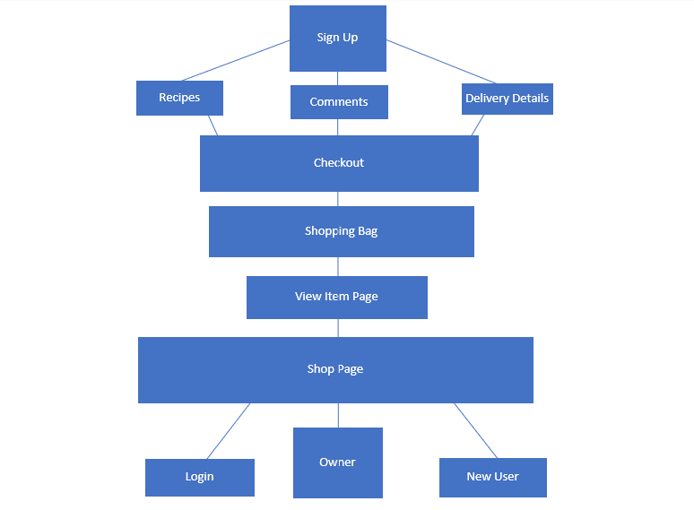
</h2>

### Skeleton Plane

The interface is aesthetically functionally all the time creating a positive reaction in the user with every click, 
making the user feel both at home here and part of an interesting journey. Details of this are found in the Design section.

[Back to Table of Content](#table-of-content)

### User stories

 - #### First Time User Goals

1. As a First Time User, I want to learn what the site has to offer and how to use the site quickly.
2. As a First Time User, I want to view specific categories and specific products.
3. As a First Time User, I want to search for specific products, know if it's available or not and see how many results there are for the search.
4. As a First Time User, I want to sort products by price, rating and category.
5. As a First Time User, I want to find the best prices for different sizes or quantities of each product.
6. As a First Time User, I want to know what I have added to my shopping bag, make updates or remove items and see the total.
7. As a First Time User, I want to purchase specific products quickly without having to sign up.
8. As a First Time User, I want to register easily.

 - #### Returning User Goals

1. As a Returning User, I want to easily login and logout.
2. As a Returning User, I want to view or update my profile.
3. As a Returning User, I want to see products ratings and reviews.

  - #### Frequent User Goals

1. As a Frequent User, I want to view my order history and payment details.
2. As a Frequent User, I want to easily recover my password if I forget it.
3. As a Frequent User, I want to view the latest recipe and all recipes.
4. As a Frequent User, I want to view and add comments and questions.

  - #### Owner/Admin User Goals

1. As the Owner/Admin User I want to upload new products.
2. As the Owner/Admin User I want to edit product details.
3. As the Owner/Admin User I want to edit product prices.
4. As the Owner/Admin User I want to edit images.
5. As the Owner/Admin User I want to delete images and products.
6. As the Owner/Admin User I want to upload new recipes.
7. As the Owner/Admin User I want to edit recipes.
8. As the Owner/Admin User I want to post or respond on chat to users questions.
9. As the Owner/Admin User I want control over material posted on the site for legal and other purposes.

[Back to Table of Content](#table-of-content)

## Design

<h2 align="center">
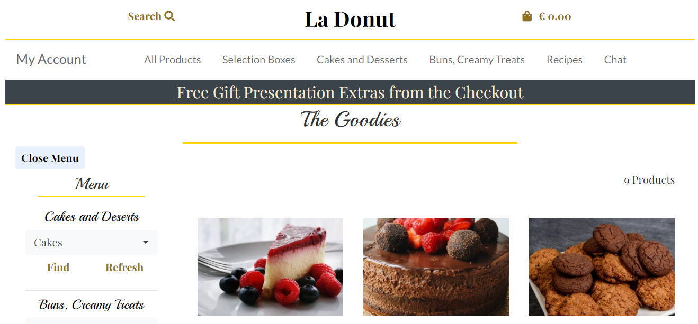
</h2>

### Colour Scheme
 - The site aims to be elegant, upmarket, clean, sharp, bright and sophisticated using a white background with gold lines and some gold text/icons along with the odd blue buttons and links for some more perfunctory actions. The actual images themselves supply the main bulk of the content and in doing so will greatly influence the overall colour scheme so I wanted a sophisticated sharp white and gold containment background. I gave the login and other Allauth pages a warm friendly look with a background image of a pink whipped cream.

  
### Typography
 - Playfair Display, a serif non-formal friendly font was used as the main font for the site. It has a sophisticated slightly old fashioned classy feel. Lato was used along side it for more matter of fact details. And Playball, a very stylish, flamboyent romantic feeling font was used for the main titles and in some other places to give the shop a classy romantic feel.

### Imagery
 - Set against the sophisticated white and gold background the cake and pastry images speak for themselves to entice the customers with mouth watering delights.

### Wireframes

 - PDF – Balsamic was used to design the layout for all pages.

   [View on Github](https://github.com/johnston9/la-donut)

[Back to Table of Content](#table-of-content)

## Existing Features

### Responsive Design

- The site is responsive to all sizes and the images remain whole and in proportion at all sizes. 

 <strong>Large Screen</strong>

<h2 align="center">
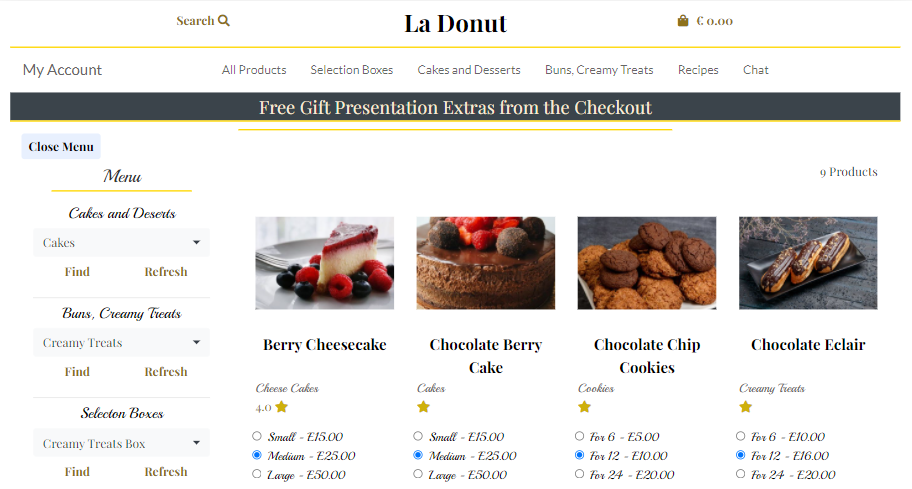
</h2>

 <strong>Small Screen 320px</strong>

<h2 align="center">
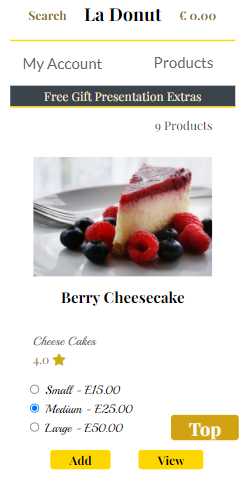
</h2>

 
[Back to Table of Content](#table-of-content)

### Allauth Login/Register/Logout Pages and Security

  The user can browse and purchase items on the site but they are encouraged to create an account. They can do this or login or logout easili From My Account in the navbar. There are also a number of other links to register, one being on the Home page, and on doing so the user is brought to the Allauth Register page. Like all other Allauth pages I customised it to give to a personal easy to use friendly feel. Allauth is used throughout the site to look after all security issues concerning users and deals with all other issues like forgetting passwords and email confirmations. 
  See [Allauth](documentation/allauth) for all Allauth images and testing images.

  The site has a number of other security measures firstly the use of front end measures to allow admin access only to admin. Then in the backend the use of @login_required for pages only for authenticated users and a redirect if the user is not a superuser for admin only functions.

<strong>Login Page</strong>

<h2 align="center">
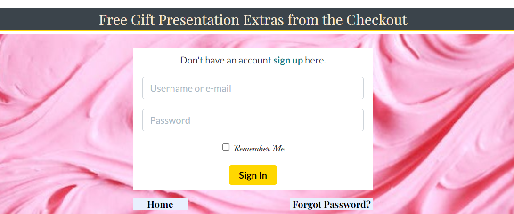
</h2>

 See Further Testing login and register pages.

 - [Back to Table of Content](#table-of-content)

### Recipes Page

  This page shows images of different recipes the user can click on and go to each one. There is a Latest Recipe link on the Checkout Complete page to take the user to the Latest Recipe. This is a feature designed to take the user further into the site and create an account. Under each recipe there is a link to view or add comments on the Chat Page for which the user need to create an account. See...

<strong>Recipes Page</strong>

<h2 align="center">

</h2>

<strong></strong>

<h2 align="center">

</h2>

[Back to Table of Content](#table-of-content)

### ChatPage

  Once the user registers they can avail of the chat feature which allows they to chat to the Master Pastry chef and view other user's chats.

<strong>Chat</strong>

<h2 align="center">

</h2>

[Back to Table of Content](#table-of-content)

### Superuser Features

  As discussed above in "Security Measures" defensive programming will only allow access to the admin features if user is a superuser user and this is implemented both in the front-end and back-end. The superuser/owner can upload products and recipes and edit and delete them as well. They can delete a user from admin also. When they go to the chat page a check box displays for them only and on checking it will add is_shop to the chat object which is interpretted in the template to render a certain style to let the users know that message is from the shop.

<strong>Admin Features on the Shop Page</strong>

<h2 align="center">
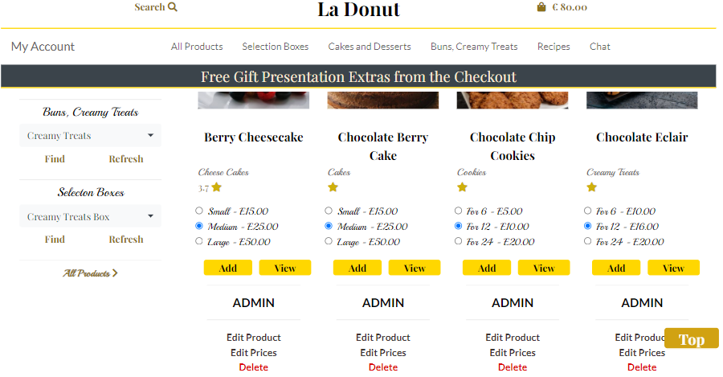
</h2>

Please see admin testing for further details.

### Optimum Image Showcase
The site is designed for the owner to show their products and I believed it good practice to give then a little instruction to help then intuititively learn how it is best to do this. The site uses responsive design to display the products and this is ideal however it does need a little management on the owners behalf for them to make best use of the feature.  

If the owner was to upload all images at the same aspect ratio this would not be an issue but even so they would still need to understand this and arrange for all images to be of that size and that no one ever upload one of a different size. So to safeguard against different size images I set specific heights for the images at different screen sizes. This would keep the rows uniformed. 

I also gave instructions to the owner when they first arrive on the upload product page. They inform the user that a aspect ratio of 3:2 to best for all images and there is then a link to img-resize where they can resize an image if necessary. There is a further link to instructions on how best to actually do this.  

These instructions along with the practice of uploading the images should help the owner intuitivly learn how to manage the site and give them a good feeling of their capabilities over it and how to best showcase their products. 

<strong>Resize Instructions</strong>

<h2 align="center">
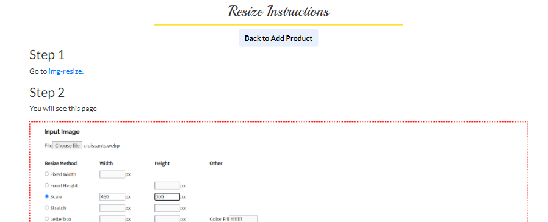
</h2>

[Back to Table of Content](#table-of-content)

### Size and Box Quantity Prices

The owner is given the option to add size or box quantity prices to an item when they upload it. They simply check the box for which one they want. Upon submit they are automatically taken to the size or box quantity (which I have called the "Forsix" ) form to add the prices for that product. On the shop page and also on the view item page these price are displayed in radio boxes so that specif size or forsix and it's coinciding price can be added to the bag. This process called for a lot for precise code throughout the site as the boolean is_sizes or is_for_six and the particular size or forsix and it's price were needed at a number of places.

##### The forsix/size journey

 1. The owner selects is_sizes or is_for_six when uploading a product. A check is in place in the view to prevent a user selecting both. On submit a signal creates a Size and Forsix model object for that product. This is a safety measure to ensure products have a Size or Forsix model related to it or it would cause problems when Django goes to find the prices for that product were it not there. Further saftey measures are in the template if for some reason the Size or Forsix model was not found in the view.

 
<strong>Safety Check Against Both Being Checked</strong>

<h2 align="center">
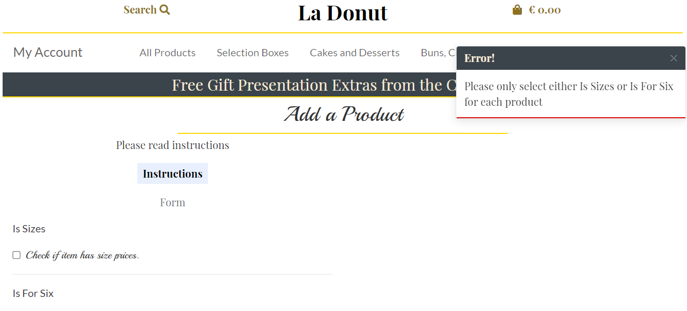
</h2>

 2. The owner inputs the size of forsix prices.

 3. The user selects a product and it's id is added to the bag with either 
    'items_with_size' or 'items_with_forsix' as a key in it's value 
    which has in turn as a value the items size or forsix attached to it's price 
    and it's quantity.
  
 4. The context.py file intreprets this to get the id, size or forsix and price which it add to the bag_items variable as well as updating the total.

<strong>Print-out of bag items and session bag</strong>

<h2 align="center">
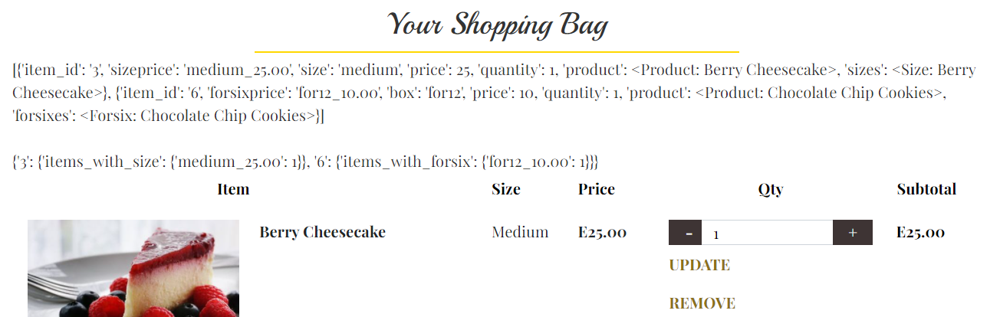
</h2>

### Checkout and Stripe
Stripe is used to process the order.  
  1. Once the user clicks the checkout button on their Shopping Bag page a Stripe payment intent is created, the total being calculated from the contect.py function and the user are taken to the Checkout page.

<strong>Checkout Page</strong>

<h2 align="center">
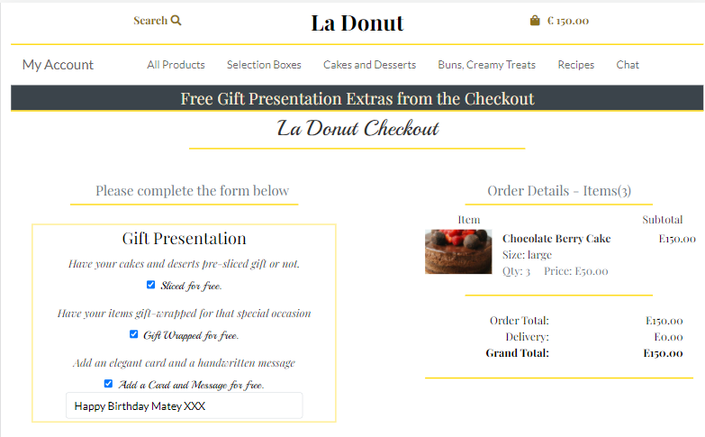
</h2>

  2. On the checkout page they will see a list of their order items, the delivery details form and card form. If they are a registered user and have clicked save info on a previous order or added their details to their profile before, their delivery details will be prefilled. If not they can check save info and they will save now. If they are a registered user the Gift Presentation Extras will be on display.

  3. After the user does or doesn't select any Gift Extras, then fills in the delivery and card detail and clicks submit, first metadata, including the Gift value, is added to the intent before the form is submitted. If the form is OK the order is saved, again getting the item details using the 'items_with_size' or 'items_with_forsix' bag keys. 

<strong>Order Success Message</strong>

<h2 align="center">
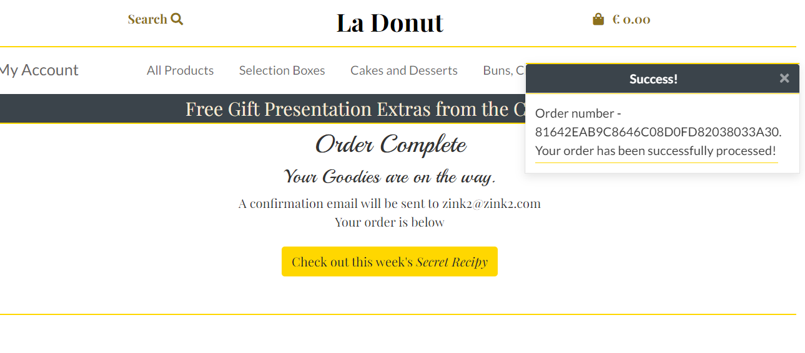
</h2>

  4. Stripe sends an Charge Succeeded webhook and a Payment Intent Succeeded. An Order Complete page is sent to the user and the webhook checks to see if the order has been successfully created in the database. After 5 checks if not it creates the order from the intent and the added metadata.

<strong>Stripe Webhooks Successful</strong>

<h2 align="center">
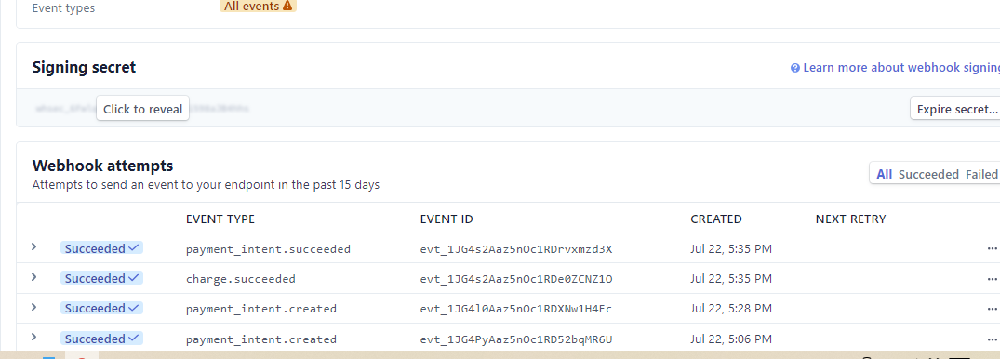
</h2>

<strong>The Metadata in the intent</strong>

<h2 align="center">
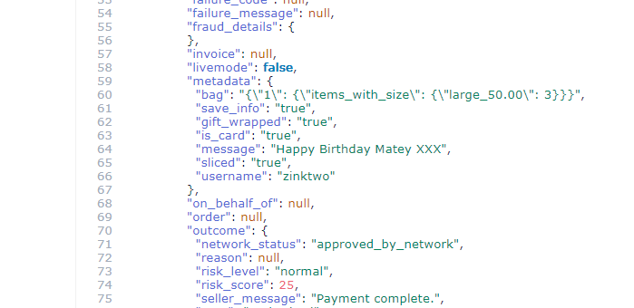
</h2>

  4. If the user has clicked save info their details will be saved to UserProfiles. They can see their updated details on their Profile page along with their order history. On clicking on an order they will be taken to it's confirmation page.

<strong>Past Confirmation page</strong>

<h2 align="center">
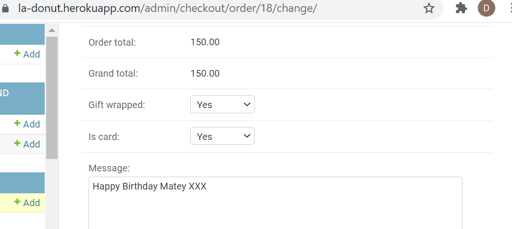
</h2>

<strong>The Order in the Database</strong>

<h2 align="center">
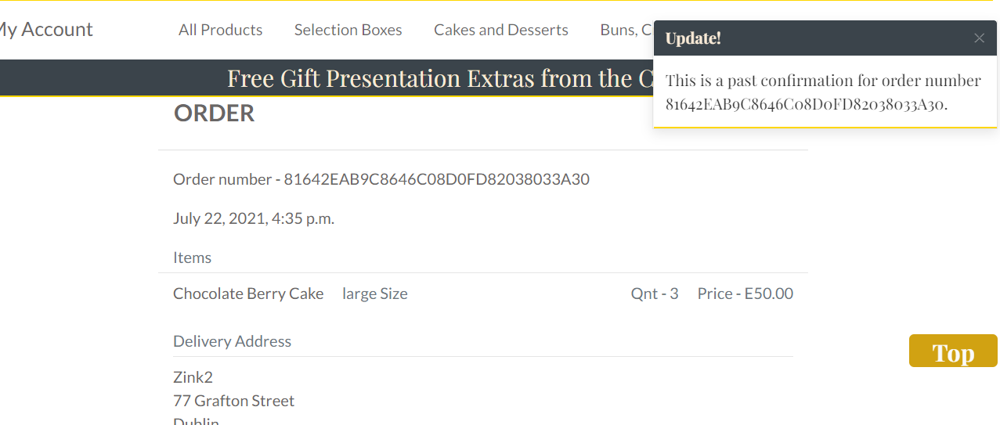
</h2>

See Further Testing [Testing Webhook Create order](#testing-webhook-create-order) for testing of the webhook creating the order.

[Back to Table of Content](#table-of-content)

## Future Features

### Social Account Login
This Allauth function allows users to sign up and log in using an existing third party account such as Google and Facebook. This would make encouraging users to sign up easier as they are just a click away and don't have to do any more. For the site owners apart from having more user sign ups this opens up hugh areas in terms of information and marketing.

### Social Media Share Icons
In terms of brand awareness through social media social media share icons would be most advantagous.

## Information Architecture

- Development 
**SQLight** was used during development and comes with Django. 

- Deployment 
**PostgreSQL** is used for deployment, and was added as an add-on with Heroku.

### Database structure - Model Tables by App

#### Django contrib auth
1 - <strong>User</strong> - to hold the authenticated users. 
  - Foreign Key to UserProfile

#### Product App
1 - <strong>Category</strong> - to hold the product categories. 

2 - <strong>Product</strong> - to hold the products.
  - Foreign Key to Category 

3 - <strong>Size</strong> - to hold the product's size prices. 
  - Foreign Key to Product

4 - <strong>Forsix</strong> - to hold the product's box quantity prices. 
  - Foreign Key to Product

5 - <strong>Review</strong> - to hold the product's reviews. 
  - Foreign Key to Product
  - Foreign Key to UserProfile

#### Checkout App
1 - <strong>Order</strong> - to hold the orders for all completed orders. 
  - Foreign Key to UserProfile

2 - <strong>OrderLineItem</strong> - to hold the order's items.
  - Foreign Key to Order
  - Foreign Key to Product

#### Profiles App
1 - <strong>UserProfile</strong> - to hold the registered users details. 
  - OneToOne Key to User

#### Recipe App
1 - <strong>Recipe</strong> - to hold the recipes. 
  - Foreign Key to User

2 - <strong>Comment</strong> - to hold the chat. 
  - Foreign Key to UserProfile

<strong>Entity Relationship Diagram</strong>

<h2 align="center">
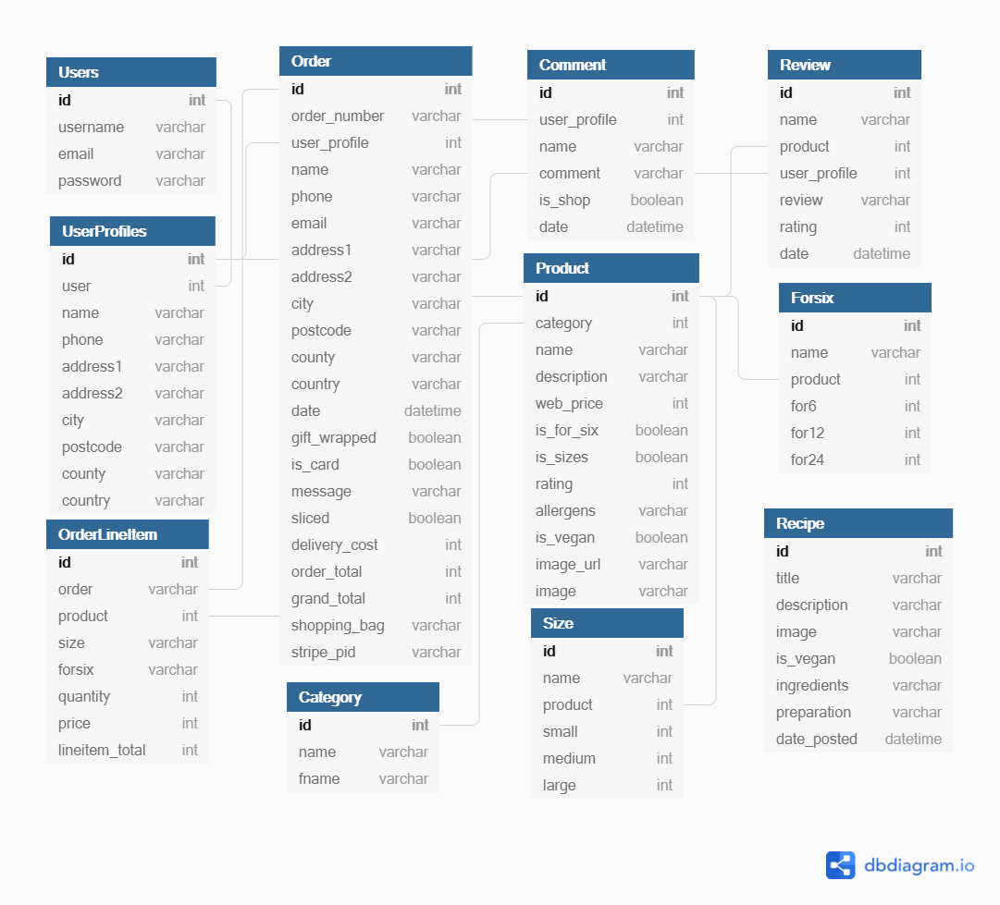
</h2>

[Back to Table of Content](#table-of-content)

## Languages Used

- [HTML5](https://en.wikipedia.org/wiki/HTML5)
- [CSS3](https://en.wikipedia.org/wiki/Cascading_Style_Sheets)
- [JAVASCRIPT](https://en.wikipedia.org/wiki/JavaScript)
- [PYTHON](https://en.wikipedia.org/wiki/Python_(programming_language))
- [djangotemplatelanguage](
  https://docs.djangoproject.com/en/3.2reftemplateslanguage/)

## Frameworks, Databases, Libraries & Programs Used

1. [Bootstrap:](https://getbootstrap.com/docs/4.6/getting-started/introduction/)
   - Bootstrap with it's grid-based format was used to create the overall framework for the site This included the primary responsiveness
     and overall styling of the website. Also specific 
     Bootstrap features, which include the "Select", 
     the "Navbar" and "Sidenav", "Modals", "Tooltipped" and "Datepickers", were used in the site.
1. [Django:](https://www.djangoproject.com/)
   - Django the high-level Python Web framework was used to build the app.
1. [SQLight:](https://www.sqlite.org/index.html)
   - SQLight came with Django and was used as the database for development.
1. [PostgreSQL:](https://www.postgresql.org/)
   - PostgreSQL was added with Heroku and was used as the database for production.
1. [Pymongo:](https://pypi.org/project/pymongo/)
   - Pymongo was used for interacting with MongoDB database from the app.
1. [Font Awesome:](https://fontawesome.com/)
   - Font Awesome was used throughout the website for the icons.
1. [jQuery:](https://jquery.com/)
   - jQuery was used along with Javascript through-out the site for front-end functionality and to initialize some Bootstrap features.
1. [Git](https://git-scm.com/)
   - Git was used for version control by utilizing the Gitpod terminal to commit to Git and Push to GitHub.
1. [GitHub:](https://github.com/)
   - GitHub is used to store the projects code after being pushed from Git.
1. [Balsamiq:](https://balsamiq.com/)
   - Balsamiq was used to create the [wireframes](https://github.com/johnston9/MS3-Shot-Caller) during the design process.
1. [Freeformatter](https://www.freeformatter.com/html-formatter.html)
   - Freeformatter was used to tidy up the final code.
1. [Gauger](https://gauger.io/fonticon/)
   - Gauger was used to create the favicon icon.
1. [Am-I-Responsive](http://ami.responsivedesign.is/):
   - Am I Responsive was used to test the site's responsive sizings and to generate responsive sizing images.
1. [GitHub Wiki TOC generator:](http://ecotrust-canada.github.io/markdown-toc/)
   - GitHub Wiki TOC generator was used to create the Table of Contents.
1. [dbdiagram.io](https://dbdiagram.io/home)
   - dbdiagram.io was used to create the Entity-Relationship Diagram.

A number of imports were used in Django for various functions and an inventory of these can be found in the Deployment section.

[Back to Table of Content](#table-of-content)

## Testing

W3C Markup Validator, W3C CSS Validator. PEP8 and JSHint were used to validate every page of the project.

- [W3C Markup Validator](https://validator.w3.org/) - [Results](https://github.com/johnston9/la-donut)
  - W3C "Direct Input" option was used on each html page where errors displayed due to template ...but on validated by URL no errors were shown - documentation/w3c-by-url.

- [W3C CSS Validator](https://jigsaw.w3.org/css-validator/#validate_by_input) - [Results](https://github.com/johnston9/la-donut)
  - W3C showed no errors and only one warning for the hr rule's background color
    being the same as it's color, but this was intentional.
  
- [JSHint](https://jshint.com/) - [Results](https://github.com/johnston9/la-donut)
  - JSHint was used with "New JavaScript features (ES6)" and "jQuery" checked in the configuration menu.
    
- [PEP8 online check](http://pep8online.com/) - [Results](https://github.com/johnston9/la-donut)
  - PEP8 approved all pyhton pages. It gave a "no newline at end of file"
    but I researched this and found it was a common result and could be ignored. I explored the matter more and found that if
    the curser was at the start of the new line, I got an "All Right" result.

- [PythonChecker](https://www.pythonchecker.com/) - [Results](https://github.com/johnston9/la-donut)
  - PythonChecker gave 100% result.

[Back to Table of Content](#table-of-content)

## Testing User Stories from User Experience (UX) 

### First Time User Goals

1. #### As a First Time User, I want to learn what the site has to offer and how to use the site quickly.

    - The site is designed for first time learning. It is streamlined for specific user goals that upon first use the user with a few clicks will be able to find any item, feature or page. At the top of every page the navbar displays all options for the user so they can select their desired destination quickly and a menu is available on landing on the shop page.

<strong>Navbar and on Entry Shop Page</strong>
   
<h2 align="center">

</h2>

2. #### As a First Time User, I want to view specific categories and specific products.

    - Upon entering the user is take to the shop page where they can use the menu to find specific categories. They have the option to close the menu to shop from a larger items page and browse directly from the navbar. 

<strong>Menu Input</strong>
   
<h2 align="center">
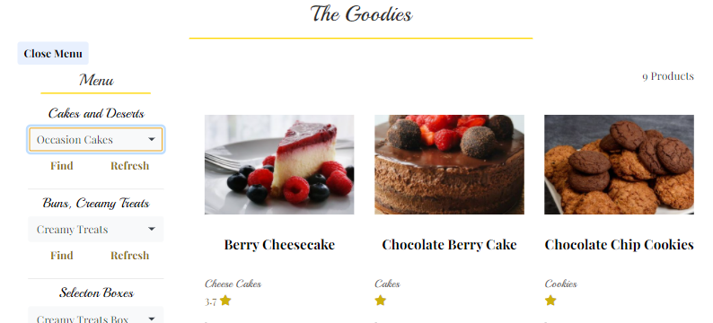
</h2>

<strong>Menu Result</strong>
   
<h2 align="center">
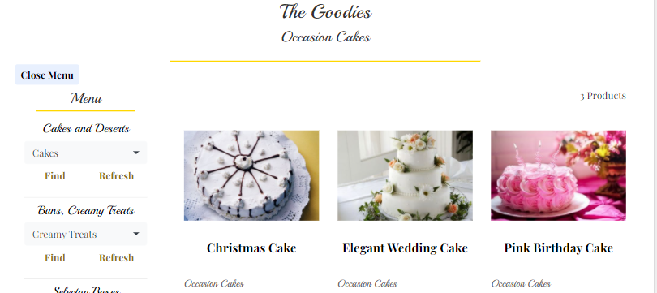
</h2>

3. #### As a First Time User, I want to search for a specific product, know if it's available or not and see how many results there are for the search.

    - At the top of all pages is a search bar where the user can search for specific items. The number of results is displayed above the results or a message sating there were no results if that is the case.

<strong>Search Input</strong>
   
<h2 align="center">
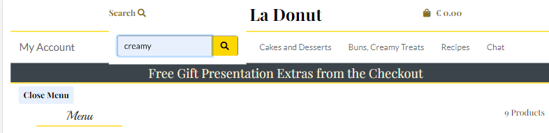
</h2>

<strong>Search Result</strong>
   
<h2 align="center">
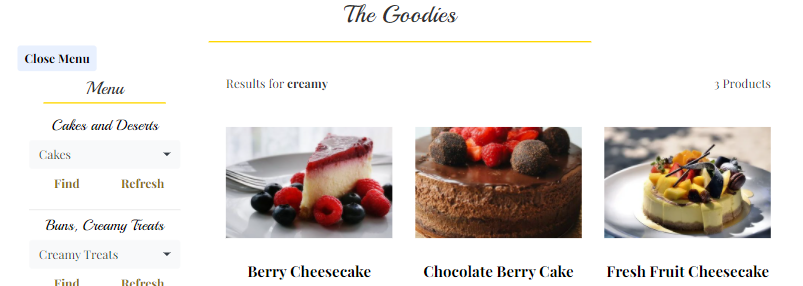
</h2>

4. #### As a First Time User, I want to sort products by price, rating and category.

    - The user can sort products by price - high to low or low to high, rating -high to low and category from the navbar and have the amount of products found display on top as well as the current sorting value the have chosen.

<strong>Sorting Selection</strong>
   
<h2 align="center">
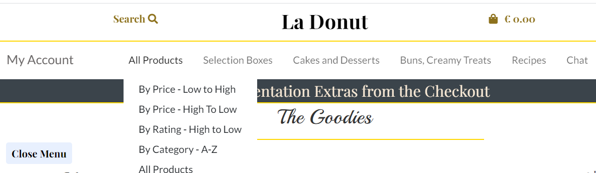
</h2>

<strong>Sorting Result</strong>
   
<h2 align="center">
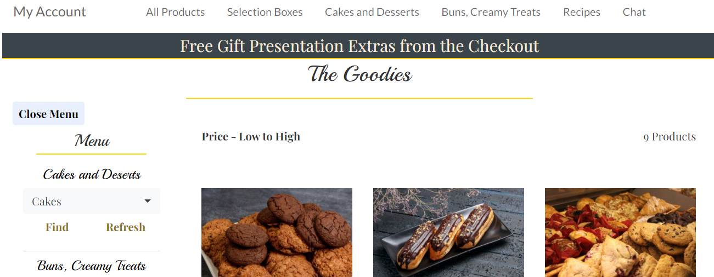
</h2>

5. #### As a First Time User, I want to find the best prices for different sizes or quantities of each product.

    - All products have their prices showing for their sizes, if they have them or box quantity if they have them, both at first glance on the shop page or on closer inspection on the view item page. 

<strong>Prices</strong>
   
<h2 align="center">
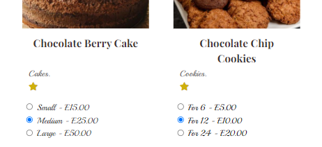
</h2>

6. #### As a First Time User, I want to know what I have added to my shopping bag, make updates or remove items and see the total.

    - Upon the adding of an item to the shopping bad a success message shows with a preview of all bag items and total and a link to the actual bag. The users total, updated on every transaction is displayed at the top of every page with a link to the bag. on going to the bag the user can see all their items and total and update select item quantities or remove the item entirely. A confirm alert displays if a user clicks Remove.

<strong>Add item Success Message
   
<h2 align="center">
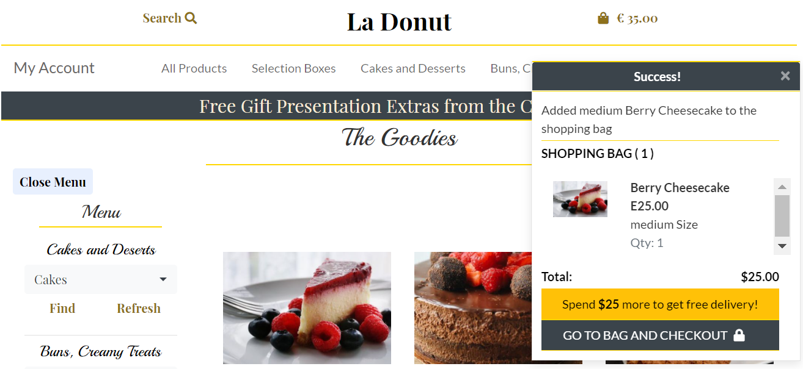
</h2>

<strong>Update item in Shopping Bag
   
<h2 align="center">
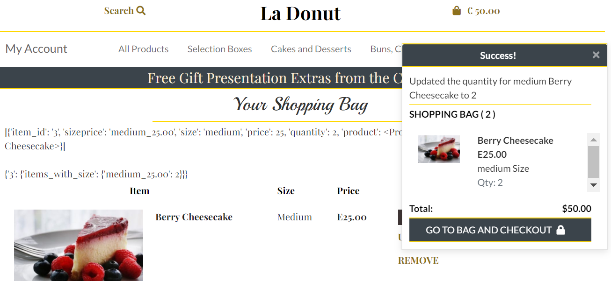
</h2>

<strong>Confirm Delete item in Shopping Bag
   
<h2 align="center">
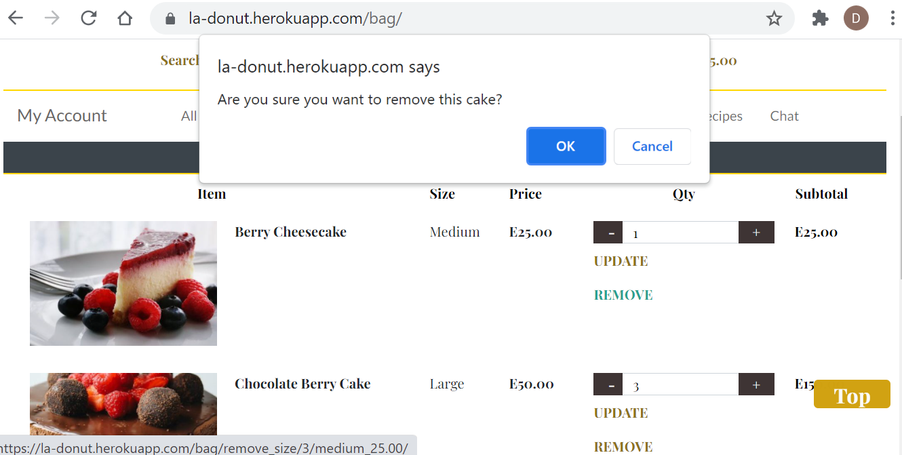
</h2>

<strong>Delete item in Shopping Bag Success Message
   
<h2 align="center">
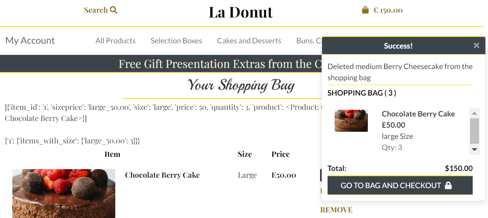
</h2>

7. #### As a First Time User, I want to purchase specific products quickly without having to sign up.

    - All users can purchase items without having to sign up. The user can make a quick selection of any item and the size or box quantity they want right from the shop page without having to go to the view item page. This is also intended for regular users who know what the want and want to select items quickly. See prices image above.

8. #### As a First Time User, I want to register easily.

    - The user will be given the option to sign up from the landing page, when they go to checkout and anytime in the My Account nav link. On clicking they will be take to the Register Page and only have to enter a username, email and password to sign up. The Registration page as with all Allauth page has been customised for greater user experience. 
    See [Allauth](documentation/allauth) for all Allauth images.

<strong>My Account Nav Link</strong>
   
<h2 align="center">
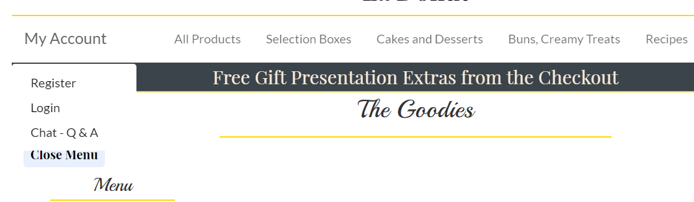
</h2>

<strong>Register page - Mobile view</strong>
   
<h2 align="center">
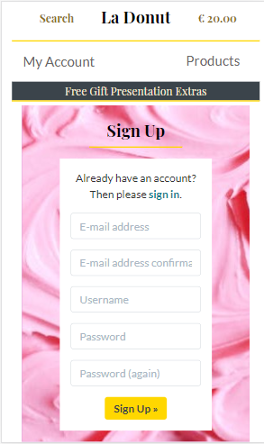
</h2>

[Back to Table of Content](#table-of-content)

### Returning User Goals

1. #### As a Returning User, I want to easily login and logout.

    - The user can login and logout easily from the My Account nav link which takes them to customed Allauth pages.  
    See [Allauth](documentation/allauth) for all Allauth images.

<strong>Logout - Mobile View</strong>

<h2 align="center">
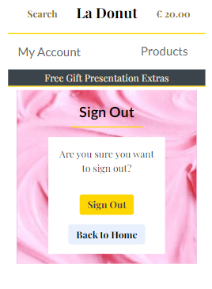
</h2>

2. #### As a Returning User, I want to view or update my profile.

    - On clicking on the profile nav link in My Account the user is taken to their Profile Page where they can update their Primary Delivery Address and recieve a success message on doing so. This info is preset as the Delivery address when they checkout.

<strong>Profile Page</strong>

<h2 align="center">
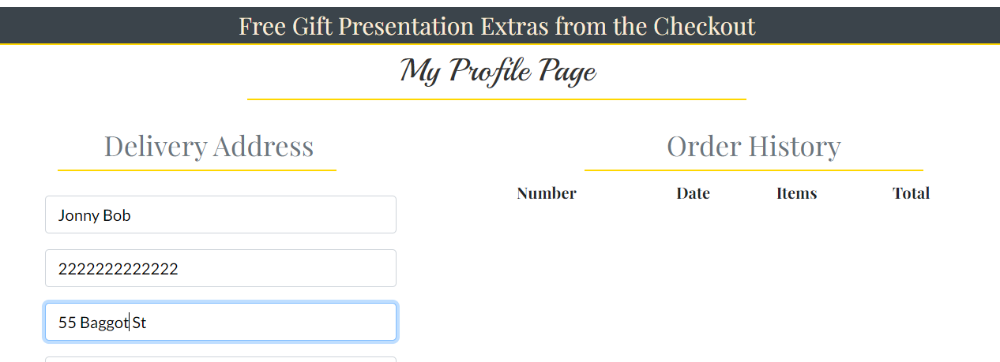
</h2>

<strong>Profile Page Update Success Message</strong>

<h2 align="center">
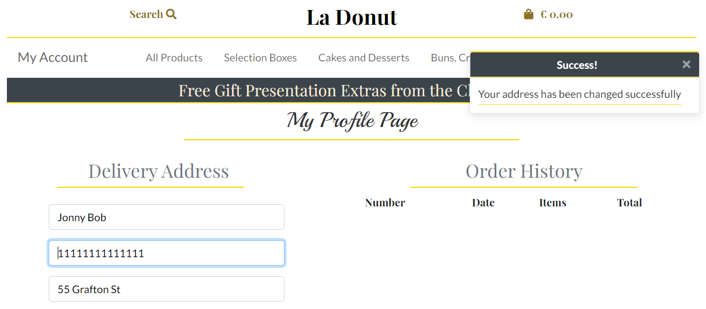
</h2>

3. #### As a Returning User, I want to see products ratings and reviews.

    - The product average customer rating is displayed for each item on the shop and view item pages. On the view item page the user will see a link to the item's reviews and another link to add a review if the user is authenticated or sign up to add a review if not. On the add review page the user can rate the product and this is displayed in stars on their review and also used to calculate the average rating. A customised Bootstrap paginated table is used to hold the reviews which includes a search function which I figured out from the Bootstrap4 docs. 
    
    [DataTables](https://datatables.net/examples/styling/bootstrap4)
    [Supervalue](https://supervalu.ie/real-food/recipes/tiramisu?ref=meal_planner)

<strong>Review Page</strong>

<h2 align="center">
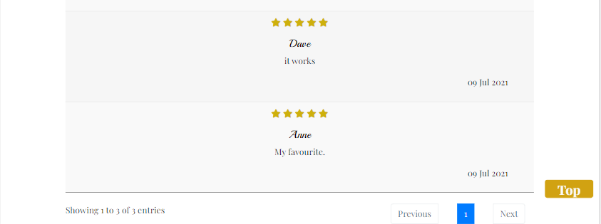
</h2>

<strong>Add Review Success message</strong>

<h2 align="center">
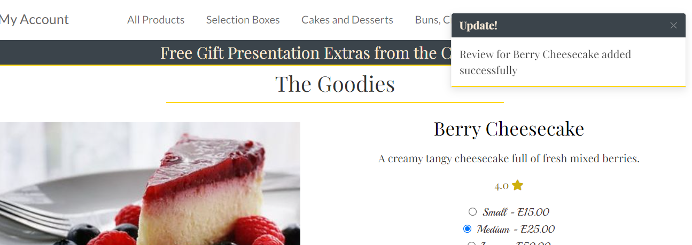
</h2>

<strong>Result</strong>

<h2 align="center">
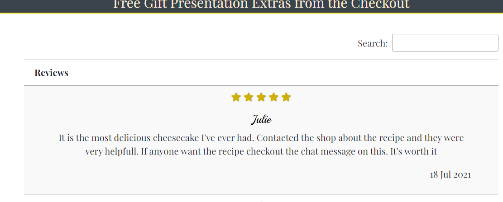
</h2>

### Frequent User Goals

1. #### As a Frequent User, I want to view my order history and payment details.

   - When the user goes to their Profile they will find their order history there. On clicking on an order they will be taken to the checkout complete message recieved for that order.
  

<strong>Order History</strong>

<h2 align="center">

</h2>

2. #### As a Frequent User, I want to easily recover my password if I forget it.

   - When the user clicks forgot password on their login they will be taken to a customizes series of Allauth pages to get a new password. 
   See [Allauth](documentation/allauth) for all Allauth images.
  

<strong>Reset Password</strong>

<h2 align="center">
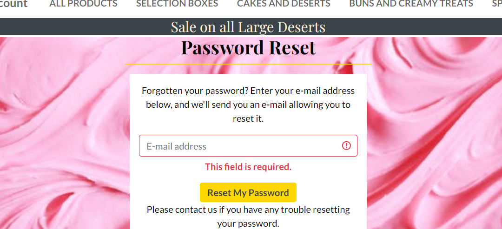
</h2>

6. #### As a Frequent User, I want to view the latest recipe and all recipes.

   1. When the user clicks Recipes in the nav they will be taken to the Recipe Page where they can select a Recipe and be taken to a page for it. Also, to entice the user to sign up, upon completing an order a large button displays on the checkout complete page to take them to the Latest Recipe. Below the recipe they are prompted with another button to view comments and question on the Chat page. There they have to register to post a question.
  

<strong>Recipe page</strong>

<h2 align="center">

</h2>

6. #### As a Frequent User, I want to view and add comments and questions.

   1. The user can click the chat link in the nav to go directly to the Chat page or, as mentioned directly above, click on the link below each recipe and sign up to add messages or just read them without doing that. If there post a question directed to the pastry chefs it will be replied to by a shop superuser.
  

<strong>Chat Page</strong>

<h2 align="center">

</h2>

### Owner/Admin User Goals

1. #### As the Owner/Admin User I want to upload new products.

   - As a superuser the owner can easily click on the Add Product link in their My Account link in the nav which will take them to the Add Product page. There they will first see an instructions button and be asked to read them. Upon clicking it the instructions will open. They can keep it closed or refer to it as thet familiarize themselves with the upload process. The instructions go into great detail about the uploading images process as this is paramont to the site being used to it's greatest advantage.  
   See [Existing Features - Optimum Image Showcase](#optimum-image-showcase) above for more on this.
   The instructions also inform the user about how to add size or box quantity prices to each product. 
   See [Existing Features - Size and Box Quantity Prices](#size-and-box-quantity-prices) above for more on this.
   

<strong>Upload Product Page Instructions</strong>
     
<h2 align="center">
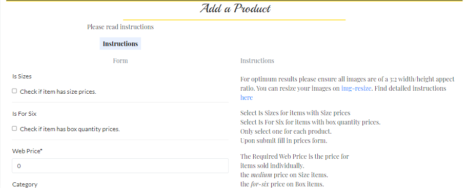
</h2>

<strong>Select image from user device</strong>
     
<h2 align="center">
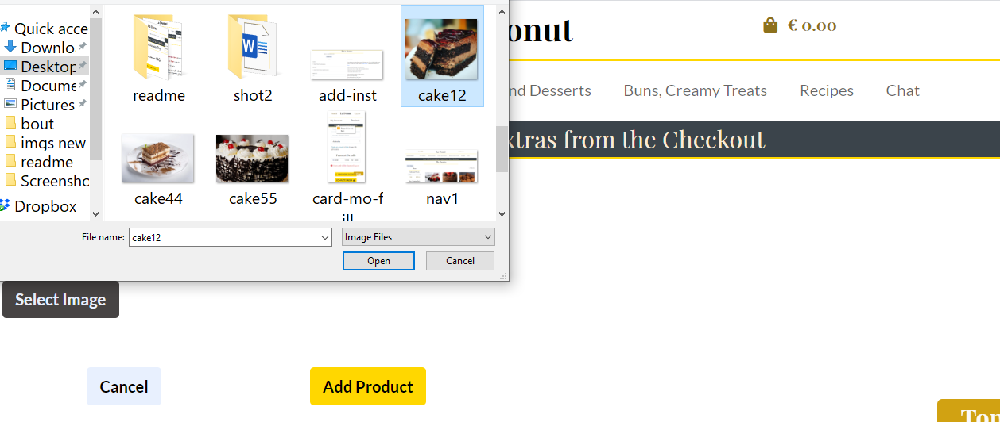
</h2>

<strong>Selected image from user device</strong>
     
<h2 align="center">
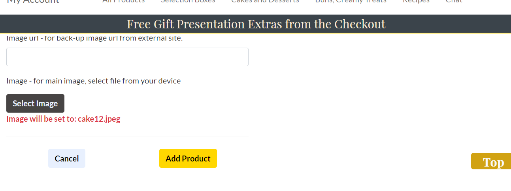
</h2>

<strong>After Submitting Add Product Add Prices</strong>
     
<h2 align="center">
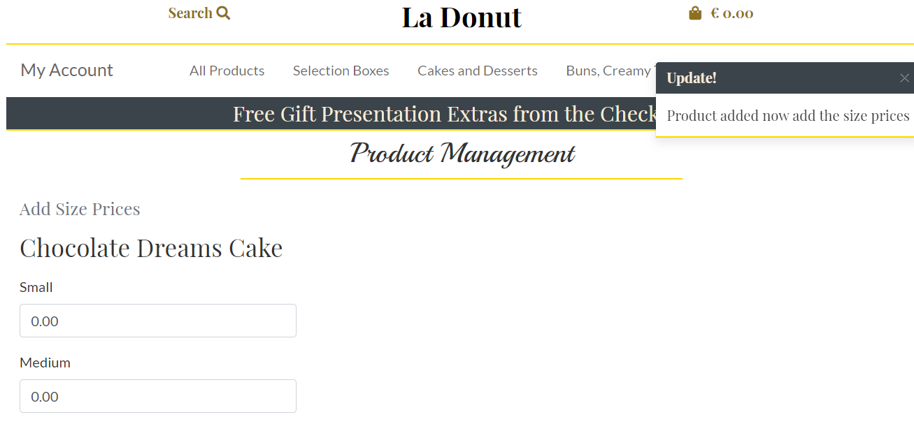
</h2>

<strong>Success Message Product Added</strong>
     
<h2 align="center">
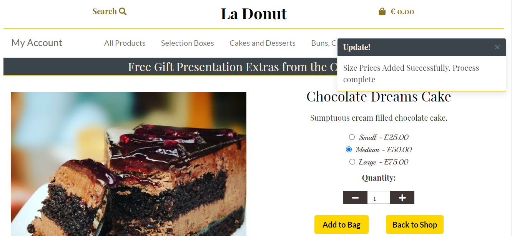
</h2>

2. #### As the Owner/Admin User I want to edit product details.

   - As a superuser the owner can easily click on the Edit Product link under each Product in the View Item page which will take them to the Edit Product page where they can update a product or it's image. On doing so a success message will display.

<strong>Edit Product Info message</strong>
       
<h2 align="center">
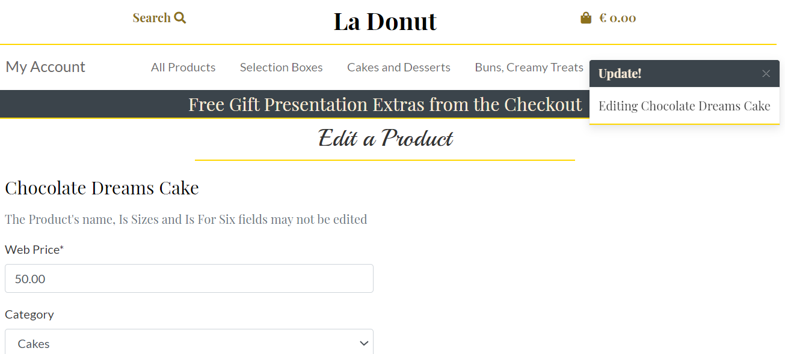
</h2>

<strong>Edit Product Success message</strong>
       
<h2 align="center">
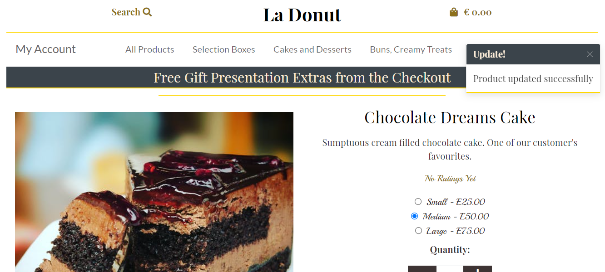
</h2>

3. #### As the Owner/Admin User I want to edit product prices.

   - As a superuser the owner can easily update a product's webprice in the Edit product page if that item does not have size or forsix prices. If it does thet can click on the Edit Prices link under each Product in the View Item page which will take them to the Edit Size Prices or Edit Forsix Prices pages. On doing so a success message will display.

<strong>Edit Prices Info message</strong>
       
<h2 align="center">
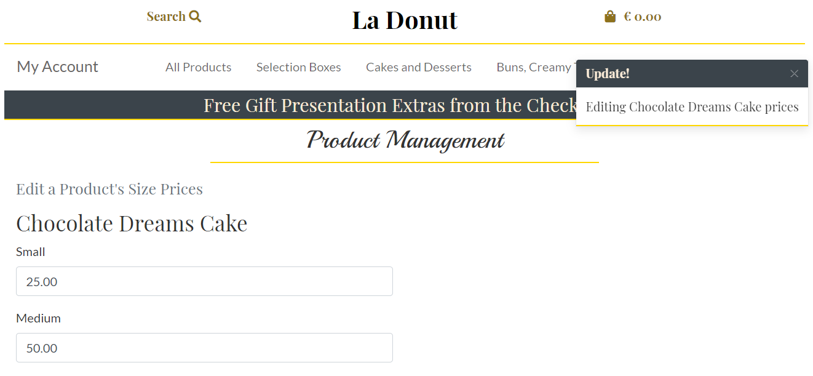
</h2>

<strong>Edit Prices Success message</strong>
       
<h2 align="center">
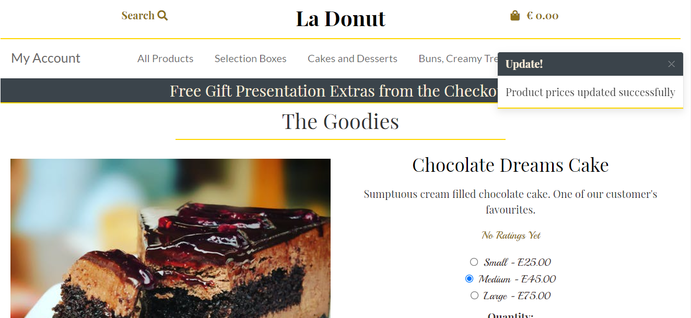
</h2>

4. #### As the Owner/Admin User I want to edit images.

   - As a superuser the owner can easily click on the Edit Product link under each Product in the View Item page which will take them to the Edit Product page where they can update a product image. The same applies for Recipe images. On doing so a success message will display. The image field was customize using the code from Boutique Ado which I just tweeked a bit and add a second widgets.py and clearable_file_input.html to the Recipe app.

<strong>Delete Image Alert</strong>
      
<h2 align="center">
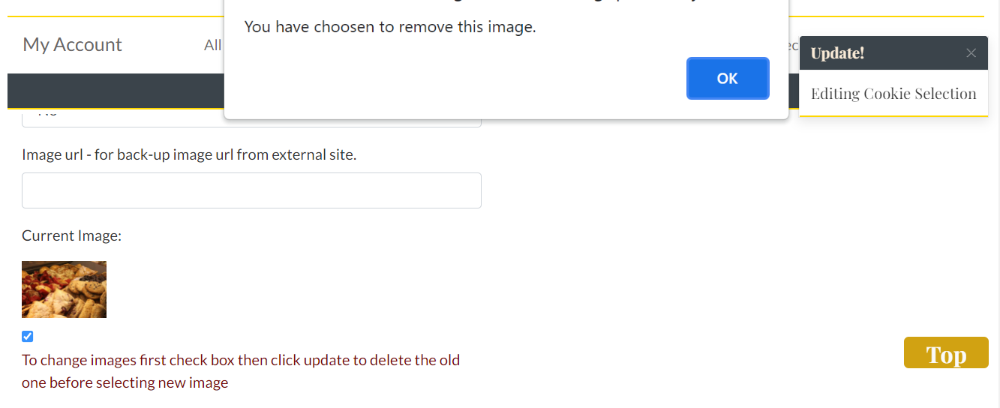
</h2>

5. #### As the Owner/Admin User I want to delete images and products.

   - As a superuser the owner can easily click on the Edit Product link under each Product in the View Item page which will take them to the Edit Product page where they can delete a product image. The same applies for Recipe images. On doing so a success message will display. If a user checks the delete image box a js alert displays to warn them. To delete a product the owner can easily click on the Delete link under each Product in the Shop and View Item pages. This time a confirm alert will display to ask if they are sure they want to delet it.

<strong>Delete Product Alert</strong>
      
<h2 align="center">
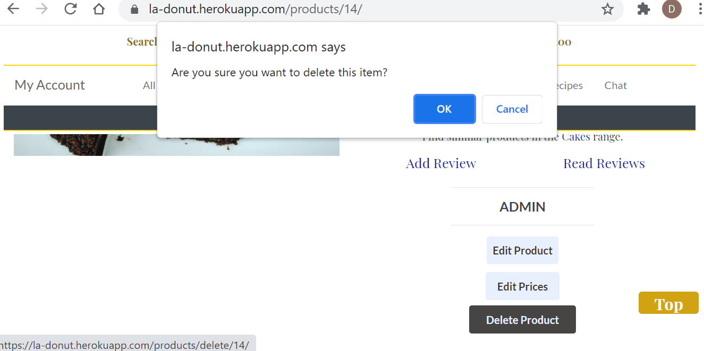
</h2>

6. #### As the Owner/Admin User I want to upload new recipes.

   - If the admin user clicks the Add Recipe link in My Account they will be taken to the Add Recipe page where they can easily add a new recipe and upload an image for it. I gave an input box for each ingredient for user friendliness and to prevent user error which could be caused if the ingredients were added to one input then split in a loop on the page. 

<strong>Add Recipe Page</strong>
      
<h2 align="center">
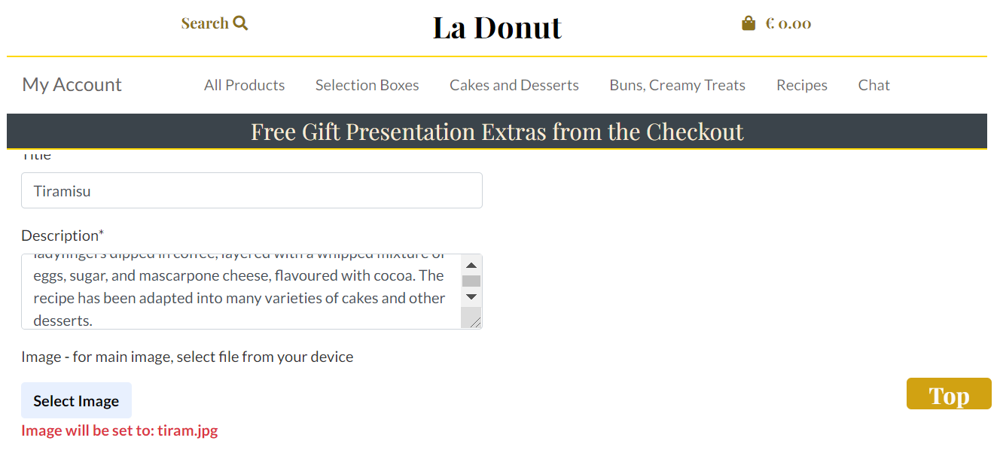
</h2>

<strong>Add Recipe success message</strong>
      
<h2 align="center">
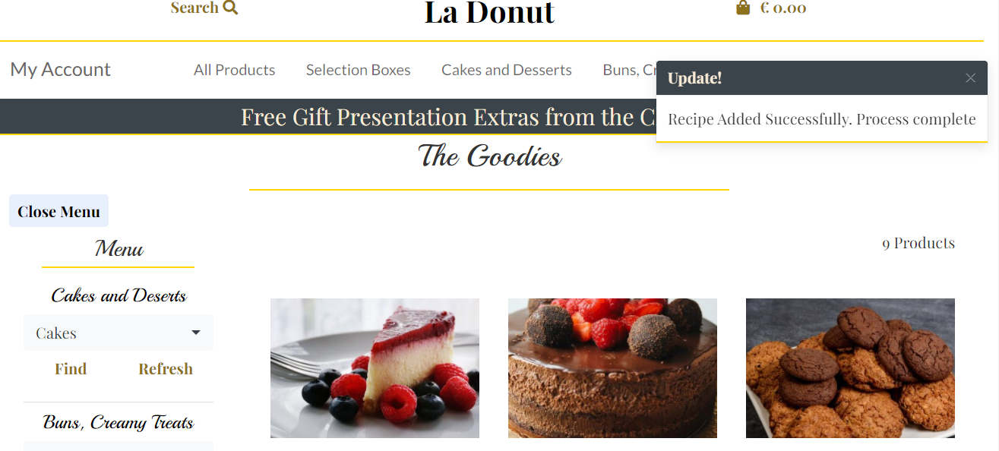
</h2>

7. #### As the Owner/Admin User I want to edit recipes.

   - If the user is a superuser an edit and delete link will display below each recipe. On clicking edit the user will be taken to the Edit Recipe page and on completion a success message will display. On clicking delete a confirm delete confirm alert will display and on clicking OK the recipe will be deleted.

<strong>Edit Recipe success message</strong>
      
<h2 align="center">
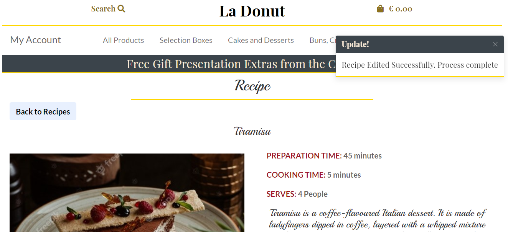
</h2>

8. #### As the Owner/Admin User I want to post or respond on chat to users questions.

   - If the admin user clicks the upload script button available only to them

<strong>Upload Product Page</strong>
      
<h2 align="center">

</h2>

9. #### As the Owner/Admin User I want control over material posted on the site for legal and other purposes.

   - If the admin user clicks the upload script button available only to them

<strong>Upload Product Page</strong>
      
<h2 align="center">

</h2>

## Further Testing
### Testing Webhook Create order

The webhook creating an order process was tested by commenting out the submit form in the stripe_elements.js and worked successfully.

<strong>Submit Commented Out</strong>

<h2 align="center">
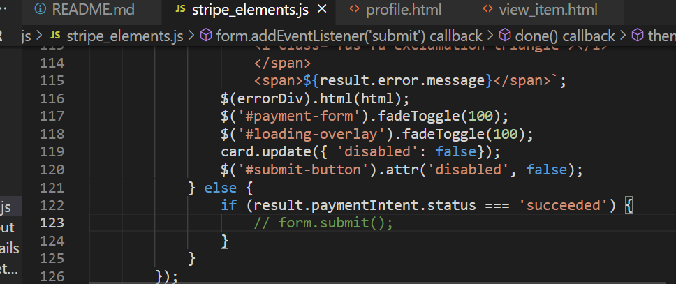
</h2>

It worked with the gift values.

<strong>Values in metadata</strong>

<h2 align="center">
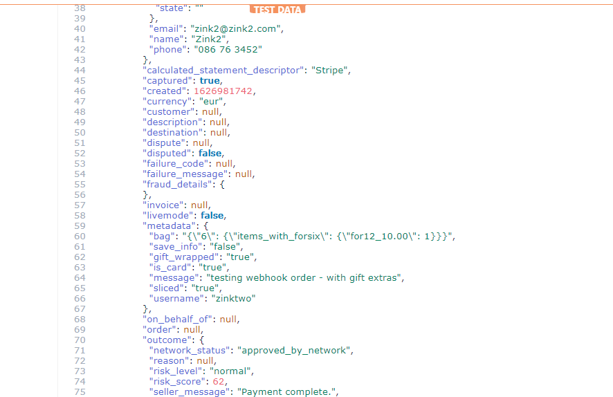
</h2>

<strong>Response confirming the webhook did create the order</strong>

<h2 align="center">

</h2>

It worked without the gift values.

<strong>Values not in metadata</strong>

<h2 align="center">

</h2>

<strong>Response confirming the webhook did create the order</strong>

<h2 align="center">

</h2>

## Bugs Fixed
### metadata
 - The adding of the metadata to the intent caused a few bugs. What is meant to happen is;
 1. stripe_elements.js checks to see if the is_saved, giftwrapped, is_card checkboxes are checked or not and get the value from the message input box.
 2. stripe_elements.js sends this data, along with some other data to the extra_checkout_info view where it is added to the intent metadata. 
 3. The handle_payment_intent_succeeded function retreives this data and uses it to add to the Order.
 
 But error 1;
 I had used Boolean...ischecked() to check the boxes and it had in fact returned strings "true" or "false" not Boolean values which threw errors and caused the payment intent succeeded to fail.
 
 And error 2;
 If there was no message the message key was not added to the intent so that threw another error and caused the same problem.

 Solution for error 1;
 I just checked the values in the handle_payment_intent_succeeded function and set the variables to either true or false depending on what the string value was.

<strong>Check Values</strong>
      
<h2 align="center">
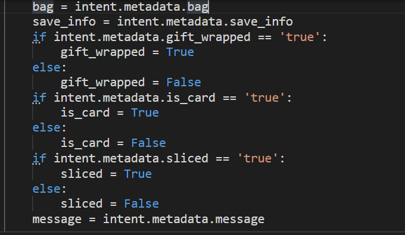
</h2>

Solution for error 2;
 I checked to see if a value existed in message in stripe_elements.js and if so set message to that, if no value set to a default value. function and set the variables to either true or false depending on what the string value was.

<strong>Check Values</strong>
      
<h2 align="center">
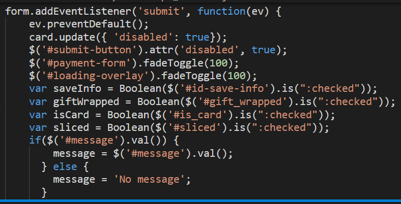
</h2>

<strong>Result of No boxes being Checked and no Message</strong>
      
<h2 align="center">
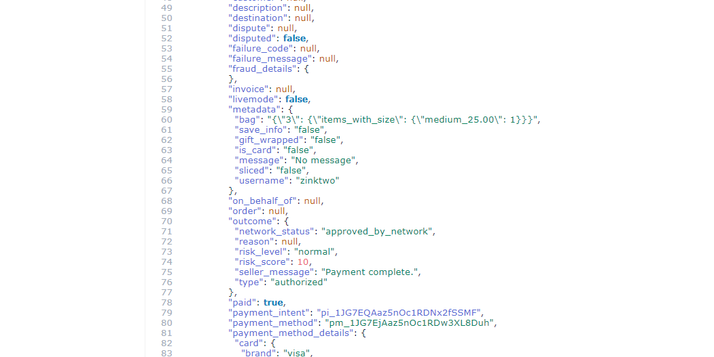
</h2>

<strong>Metadata with No boxes being Checked and no Message</strong>
      
<h2 align="center">
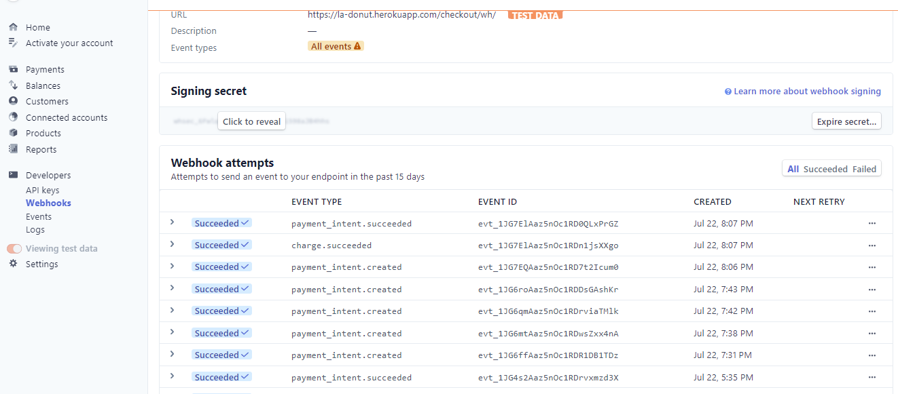
</h2>

## Bugs Ongoing5
### Payment Intent Succeeded 
There are two webhook endpoints one for Gitpod and one for Heroku.
The payment intent succeeded always sends to both when Heroku is used but for a reason I just couldn't figure out occasonally, and I mean rarely, does not send one to Heroku when Gitpod is used. All charges are completed successfully always and all other webhooks send. On checking the Stripe Logs on one of these occasions it said I needed to login again.

<strong>Stripe Logs</strong>
      
<h2 align="center">
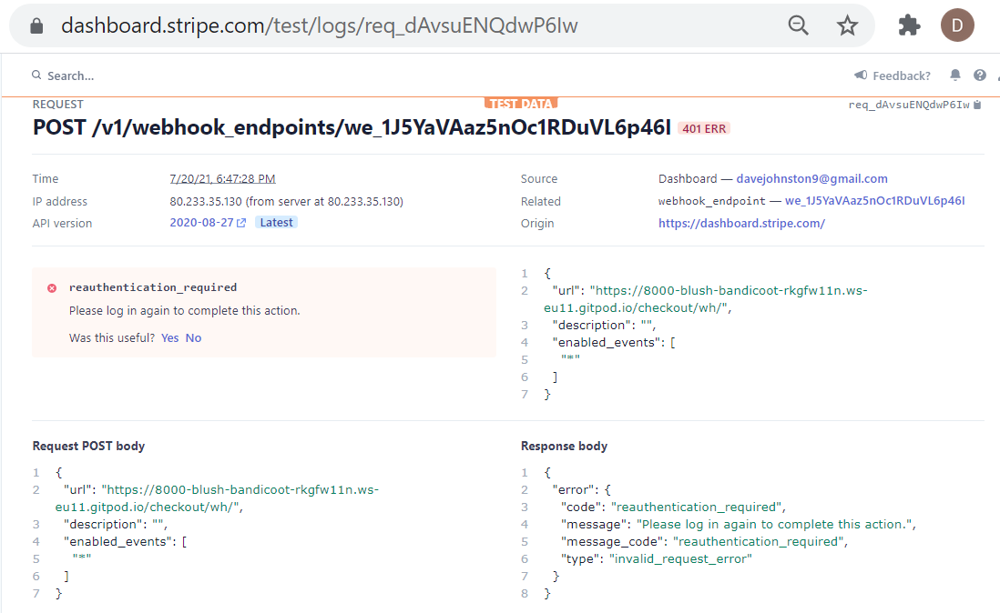
</h2>

### Heroku Logs
I noticed an "Invalid block token" warning sometimes in Heroku logs for something in Django templates base.py line 531 but there were no actual problems witht the sie always deploying.

<strong>Heroku Logs</strong>
      
<h2 align="center">
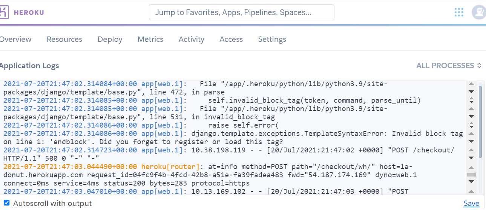
</h2>

## Bugs Fixed

### Migrations to Heroku
I redid the recipe model and migrated it to Postgres on Heroku but it threw errors when I went to load the Recipe page. After numerous unsuccessful efforts to fix this I decided to do another migration and the problem was fixed.

<strong>Bad Migration</strong>
      
<h2 align="center">
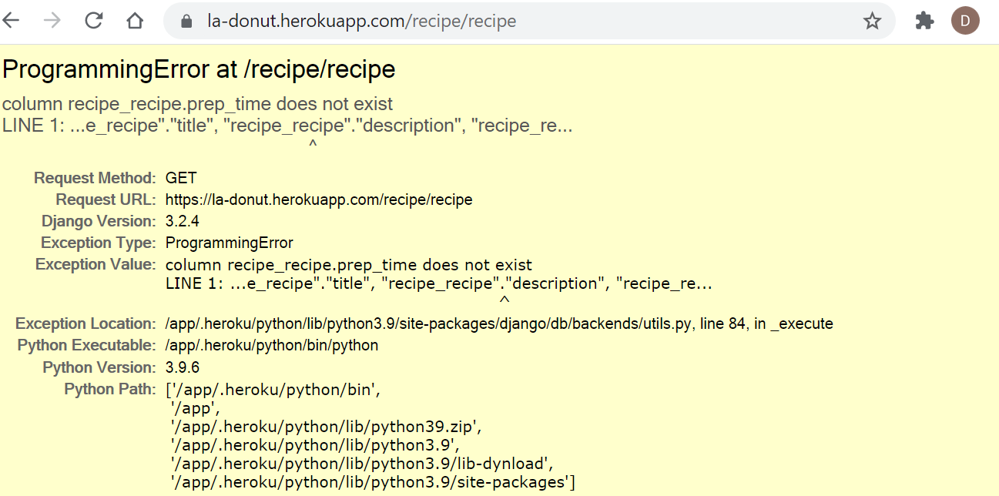
</h2>