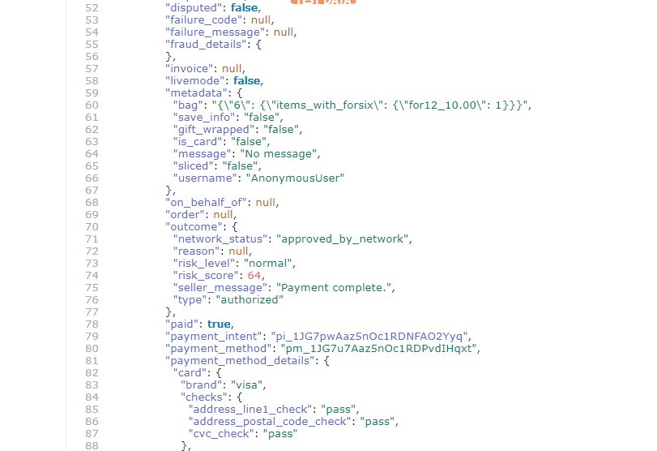
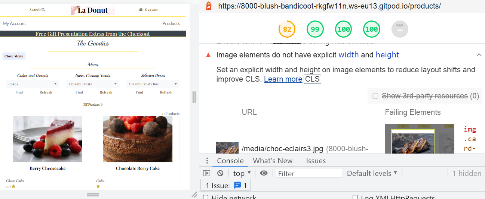
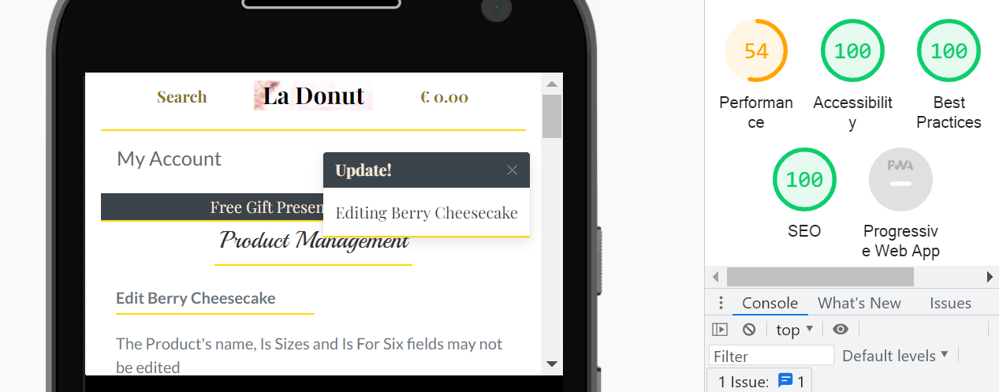

<h1 align="center"><strong>La Donut - Online Cake Shop/Patisserie Website</strong></h1>

[View the project live here.](https://la-donut.herokuapp.com/)

A web application for an online cake shop and patisserie. Primarily, the site allows the shop to display their goods and allows users to browse the goods and purchase them. Users are initally taken to a products page with a side menu from which they can select categories. They are given the option to close this and browse from the navbar where they will find a search option and another product menu.<br>
<br>
The user can select an item directly from the page or on viewing the item on it's own page. On doing so it is added to their bag which they can view at any time giving them the option to update or remove products. From the bag they can simply click to be taken to the checkout page where through Stripe they can complete their transaction.
<br>
The user is offered the option to open an account throughout the site and on completion of they purchase order with the incentive of free delivery, free gift presentation and the opportunity to participate in the online chat feature. There is also a recipes page with a latest recipe feature which is displayed apon completing an order and this in turn encourages user to go to the chat page.<br>
<br>
The shop owner can easily manage the site through the admin and manage site pages where they can upload, edit and remove goods. They are given instructions as to how to make the most of the visual promoting of goods in terms of image display. Allauth is used for site security and user authentication.<br>
<br>
The main Django app is called silverDollar.

<h2 align="center"></h2>

# Table of Content

- [User Experience (UX)](#user-experience--ux-)
  * [Strategy Plane](#strategy-plane)
  * [Scope Plane](#scope-plane)
  * [Structure Plane](#structure-plane)
  * [Skeleton Plane](#skeleton-plane)
  * [User stories](#user-stories)

- [Design](#design)

- [Existing Features](#existing-features)
  * [Responsive Design](#responsive-design)
  * [Login/Register Pages and Security Measures](#login-register-pages-and-security-measures)
  * [User Base Page](#user-base-page)
  * [Departments Page](#departments-page)
  * [Images Page](#images-page)
  * [Admin Page](#admin-page)

- [Database structure](#database-structure)

- [Languages Used](#languages-used)

- [Frameworks, Databases, Libraries & Programs Used](#frameworks--databases--libraries---programs-used)

- [Testing](#testing)

- [Lighthouse](#lighthouse)
  * [Summary of Issues](#summary-of-issues)
  * [Login page](#login-page)
  * [Register page](#register-page)
  * [User Base page](#user-base-page)
  * [Image page](#image-page)
  * [Departments page](#departments-page)

- [Testing User Stories from User Experience (UX)](#testing-user-stories-from-user-experience--ux-)
  * [First Time User Goals](#first-time-user-goals-1)
  * [Returning User Goals](#returning-user-goals-1)
  * [Frequent User Goals](#frequent-user-goals-1)
  * [Admin User Goals](#admin-user-goals-1)

- [Further Testing](#further-testing)
  * [Brute-Forcing Attacks](#brute-forcing-attacks)
  * [404 Error Handling](#404-error-handling)
  * [Login Page](#login-page)
  * [Register Page](#register-page)
  * [Logout](#logout)

- [Deployment](#deployment)
  * [Repository](#repository)
    + [Forking the GitHub Repository](#forking-the-github-repository)
    + [Making a Local Clone](#making-a-local-clone)
    + [Terminal](#terminal)
    + [Further steps required](#further-steps-required)

  * [Deploy to Heroku](#deploy-to-heroku)

- [Credits](#credits)


<small><i><a href='http://ecotrust-canada.github.io/markdown-toc/'>Table of contents generated with markdown-toc</a></i></small>


## User Experience (UX)

The business goals are to establish the online shop as a reputable purveyor of cakes and pastries of a top of the range quality, to create an online presence and establish it as a brand. It's primary purpose is to entice new customer to purchase goods and secure regular returning customers. It aims to inspire trust, familiarity and build a loyal cumstomer base.

For the user, the goal of the site is to easily browse goods or find particular items or categories and purchase them in an simple enjoyable manner. It is to find new and interesting items to try or specific item for a specific occasion. For businesses it is to have a high quality reliable supplier of pastries.

### Strategy Plane

The aim of the site is to create an app that establishes the online shop as a reputable purveyor of cakes and pastries of a top of the range quality, to create an online presence and establish it as a brand. It aims to be an enjoyable and simple shopping experience enticing new customers and building a regular, especially business client base.

It aims to create a brand to establish an image in the public eye for the shop, to show it's quality and professionalism. It aims to allow the owner full control over their content and promote their items in the best way. It's elegant bright sophisticate but simple design aims to encourage users to explore it. It's clear navigation and shopping experience encourage retuning customer and it's features, gift presentation and chat encourage user to create an account an become a loyal customer.

#### Brand Identity
- Brand promise: Highest quality and most luxurious pastries and desserts available.
- Vision: Classy romantic.
- Mission: To cater to your most luxurious culinary desires
- Values: Class and quality

### Scope Plane

The features included in the app at present reflect choices made around the following reflections.
<br>

What is absolutely necessary for the app to deliver it’s basic marketed functionality?<br>  

What is the most enticing user frendly way of doing building these?<br>

What types of design would further these and become great user experience in themselves?<br>

Which proposed features are buildable?<br>

What features are necessary to make the goods sellable, the shop sellable and in return the actual app sellable to other businesses?<br>

The buildable and time frame aspect was vital for the scope of the app and several more advance features, like Allauth Social were repositioned as future features.

[Back to Table of Content](#table-of-content)

### Structure Plane

The site is structured so the user can navigate in an intuitive way through the different features and categories of products, all pages keeping a uniformed consistency.<br>

The user is taken on a journey into the site, all elements being discoverable as they proceed along. From finding the different categories of cakes and pastries available to adding them to the shopping bag to checking out. To discovering the advantage of ceating an account and the chat other extras availabe on doing so. The site aims to, through it's freindly structure, build a relationship with the user.<br>

The Menu is a key element to the structure. Here the user can feel like they are in a real shop and have a more personal user experience and ease and control over their shopping experience.<br>

The user will see clear states of change when they interact with the features and selection and choice buttons and be given clear feedback to assure them of their interactive success.
A message, success, info, warning and error will display after every important interaction.<br>
The information architecture is a tree structure allowing users to move through content quickly and simply becoming aware of the site’s inherent structure as they go. 

<h2 align="center">

</h2>

### Skeleton Plane

The interface is aesthetically functionally all the time creating a positive reaction in the user with every click, 
making the user feel both at home here and part of an interesting journey. Details of this are found in the Design section.

[Back to Table of Content](#table-of-content)

### User stories

 - #### First Time User Goals

1. As a First Time User, I want to learn what the site has to offer and how to use the site quickly.
2. As a First Time User, I want to view specific categories and specific products.
3. As a First Time User, I want to search for specific products, know if it's available or not and see how many results there are for the search.
4. As a First Time User, I want to sort products by price, rating and category.
5. As a First Time User, I want to find the best prices for different sizes or quantities of each product.
6. As a First Time User, I want to know what I have added to my shopping bag, make updates or remove items and see the total.
7. As a First Time User, I want to purchase specific products quickly without having to sign up.
8. As a First Time User, I want to register easily.

 - #### Returning User Goals

1. As a Returning User, I want to easily login and logout.
2. As a Returning User, I want to view or update my profile.
3. As a Returning User, I want to see products ratings and reviews.

  - #### Frequent User Goals

1. As a Frequent User, I want to view my order history and payment details.
2. As a Frequent User, I want to easily recover my password if I forget it.
3. As a Frequent User, I want to view the latest recipe and all recipes.
4. As a Frequent User, I want to view and add comments and questions.

  - #### Owner/Admin User Goals

1. As the Owner/Admin User I want to upload new products.
2. As the Owner/Admin User I want to edit product details.
3. As the Owner/Admin User I want to edit product prices.
4. As the Owner/Admin User I want to edit images.
5. As the Owner/Admin User I want to delete images and products.
6. As the Owner/Admin User I want to upload new recipes.
7. As the Owner/Admin User I want to edit recipes.
8. As the Owner/Admin User I want to post or respond on chat to users questions.
9. As the Owner/Admin User I want control over material posted on the site for legal and other purposes.

[Back to Table of Content](#table-of-content)


## Design

<h2 align="center">

</h2>

### Landing page
 - The landing page image is intended to display a classy elegance. It is silghtly coloured and soft focus which becomes softer at larger screens which is suited to it's purpose.

 - A subtle image is used in the logo to add a touch of colour.

### Colour Scheme
 - The site aims to be elegant, upmarket, clean, sharp, bright and sophisticated using a white background with gold lines and some gold text/icons along with the odd blue buttons and links for some more perfunctory actions. The actual images themselves supply the main bulk of the content and in doing so will greatly influence the overall colour scheme so I wanted a sophisticated sharp white and gold containment background. I gave the login and other Allauth pages a warm friendly look with a background image of a pink whipped cream.

  
### Typography
 - Playfair Display, a serif non-formal friendly font was used as the main font for the site. It has a sophisticated slightly old fashioned classy feel. Lato was used along side it for more matter of fact details. And Playball, a very stylish, flamboyent romantic feeling font was used for the main titles and in some other places to give the shop a classy romantic feel.


### Imagery
 - Set against the sophisticated white and gold background the cake and pastry images speak for themselves to entice the customers with mouth watering delights.

### Wireframes

 - PDF – Balsamic was used to design the layout for all pages.

   [View on Github](https://github.com/johnston9/la-donut)

[Back to Table of Content](#table-of-content)

## Existing Features

### Responsive Design

- The site is responsive to all sizes and the images remain whole and in proportion at all sizes. 

<p align="center"> <strong>Large Screen</strong></p>
<h2 align="center">

</h2>

<p align="center"> <strong>Small Screen 320px</strong></p>
<h2 align="center">

</h2>

 
[Back to Table of Content](#table-of-content)


### Allauth Login/Register/Logout Pages and Security

  The user can browse and purchase items on the site but they are encouraged to create an account. They can do this or login or logout easili From My Account in the navbar. There are also a number of other links to register, one being on the Home page, and on doing so the user is brought to the Allauth Register page. Like all other Allauth pages I customised it to give to a personal easy to use friendly feel. Allauth is used throughout the site to look after all security issues concerning users and deals with all other issues like forgetting passwords and email confirmations.<br>
  See [Allauth](documentation/allauth) for all Allauth images and testing images.

  The site has a number of other security measures firstly the use of front end measures to allow admin access only to admin. Then in the backend the use of @login_required for pages only for authenticated users and a redirect if the user is not a superuser for admin only functions.

<p align="center"><strong>Login Page</strong></p>
<h2 align="center">

</h2>


 - [Back to Table of Content](#table-of-content)

### Recipes Page

  This page shows images of different recipes the user can click on and go to each one. There is a Latest Recipe link on the Checkout Complete page to take the user to the Latest Recipe. This is a feature designed to take the user further into the site and create an account. Under each recipe there is a link to view or add comments on the Chat Page for which the user need to create an account. 

<p align="center"><strong>Recipes Page</strong></p>
<h2 align="center">

</h2>


### ChatPage

  Once the user registers they can avail of the chat feature which allows they to chat to the Master Pastry chef and view other user's chats.

<p align="center"><strong>Chat</strong></p>
<h2 align="center">

</h2>

[Back to Table of Content](#table-of-content)

### Superuser Features

  As discussed above in "Security Measures" defensive programming will only allow access to the admin features if user is a superuser user and this is implemented both in the front-end and back-end. The superuser/owner can upload products and recipes and edit and delete them as well. They can delete a user from admin also. When they go to the chat page a check box displays for them only and on checking it will add is_shop to the chat object which is interpretted in the template to render a certain style to let the users know that message is from the shop.<br>
  See [Owner/Admin User Goals](#owner/Admin-user-goals) for more.

<p align="center"><strong>Admin Features on the Shop Page</strong></p>
<h2 align="center">

</h2>


### Optimum Image Showcase
The site is designed for the owner to show their products and I believed it good practice to give then a little instruction to help then intuititively learn how it is best to do this. The site uses responsive design to display the products and this is ideal however it does need a little management on the owners behalf for them to make best use of the feature. <br>

If the owner was to upload all images at the same aspect ratio this would not be an issue but even so they would still need to understand this and arrange for all images to be of that size and that no one ever upload one of a different size. So to safeguard against different size images I set specific heights for the images at different screen sizes. This would keep the rows uniformed.<br>

I also gave instructions to the owner when they first arrive on the upload product page. They inform the user that a aspect ratio of 3:2 to best for all images and there is then a link to img-resize where they can resize an image if necessary. There is a further link to instructions on how best to actually do this. <br>

These instructions along with the practice of uploading the images should help the owner intuitivly learn how to manage the site and give them a good feeling of their capabilities over it and how to best showcase their products. 

<p align="center"><strong>Resize Instructions</strong></p>

<h2 align="center">

</h2>

[Back to Table of Content](#table-of-content)

### Size and Box Quantity Prices

The owner is given the option to add size or box quantity prices to an item when they upload it. They simply check the box for which one they want. Upon submit they are automatically taken to the size or box quantity (which I have called the "Forsix" ) form to add the prices for that product. On the shop page and also on the view item page these price are displayed in radio boxes so that specif size or forsix and it's coinciding price can be added to the bag. This process called for a lot for precise code throughout the site as the boolean is_sizes or is_for_six and the particular size or forsix and it's price were needed at a number of places.

##### The forsix/size journey

 1. The owner selects is_sizes or is_for_six when uploading a product. A check is in place in the view to prevent a user selecting both. On submit a signal creates a Size and Forsix model object for that product. This is a safety measure to ensure products have a Size or Forsix model related to it or it would cause problems when Django goes to find the prices for that product were it not there. Further saftey measures are in the template if for some reason the Size or Forsix model was not found in the view.

 <p align="center"><strong>Safety Check Against Both Being Checked</strong></p>

<h2 align="center">

</h2>

 2. The owner inputs the size of forsix prices.

 3. The user selects a product and it's id is added to the bag with either<br>
    'items_with_size' or 'items_with_forsix' as a key in it's value<br>
    which has in turn as a value the items size or forsix attached to it's price<br>
    and it's quantity.
  
 4. The context.py file intreprets this to get the id, size or forsix and price which it add to the bag_items variable as well as updating the total.

<p align="center"><strong>Print-out of bag items and session bag</strong></p>

<h2 align="center">

</h2>

[Back to Table of Content](#table-of-content)

### Checkout and Stripe
##### Stripe is used to process the order. 

  1. Once the user clicks the checkout button on their Shopping Bag page a Stripe payment intent is created, the total being calculated from the contect.py function and the user are taken to the Checkout page.

<p align="center"><strong>Checkout Page</strong></p>

<h2 align="center">

</h2>

  2. On the checkout page they will see a list of their order items, the delivery details form and card form. If they are a registered user and have clicked save info on a previous order or added their details to their profile before, their delivery details will be prefilled. If not they can check save info and they will save now. If they are a registered user the Gift Presentation Extras will be on display.

  3. After the user does or doesn't select any Gift Extras, then fills in the delivery and card detail and clicks submit, first metadata, including the Gift value, is added to the intent before the form is submitted. If the form is OK the order is saved, again getting the item details using the 'items_with_size' or 'items_with_forsix' bag keys. 

<p align="center"><strong>Order Success Message</strong></p>

<h2 align="center">

</h2>

  4. Stripe sends an Charge Succeeded webhook and a Payment Intent Succeeded. An Order Complete page is sent to the user and the webhook checks to see if the order has been successfully created in the database. After 5 checks if not it creates the order from the intent and the added metadata.

<p align="center"><strong>Stripe Webhooks Successful</strong></p>

<h2 align="center">

</h2>

<p align="center"><strong>The Metadata in the intent</strong></p>

<h2 align="center">

</h2>

  4. If the user has clicked save info their details will be saved to UserProfiles. They can see their updated details on their Profile page along with their order history. On clicking on an order they will be taken to it's confirmation page.

<p align="center"><strong>Past Confirmation page</strong></p>

<h2 align="center">

</h2>

<p align="center"><strong>The Order in the Database</strong></p>

<h2 align="center">

</h2>

See Further Testing [Testing Webhook Create Order](#testing-webhook-create-order) for testing of the webhook creating the order.

[Back to Table of Content](#table-of-content)

## Future Features

### Social Account Login
This Allauth function allows users to sign up and log in using an existing third party account such as Google and Facebook. This would make encouraging users to sign up easier as they are just a click away and don't have to do any more. For the site owners apart from having more user sign ups this opens up hugh areas in terms of information and marketing.

### Social Media Share Icons
In terms of brand awareness through social media social media share icons would be most advantagous.


## Information Architecture

- Development 
**SQLight** was used during development and comes with Django. 

- Deployment 
**PostgreSQL** is used for deployment, and was added as an add-on with Heroku.

### Database structure - Model Tables by App

#### Django contrib auth
1 - <strong>User</strong> - to hold the authenticated users.<br>
  - Foreign Key to UserProfile

#### Product App
1 - <strong>Category</strong> - to hold the product categories.<br>

2 - <strong>Product</strong> - to hold the products.
  - Foreign Key to Category 

3 - <strong>Size</strong> - to hold the product's size prices.<br>
  - Foreign Key to Product

4 - <strong>Forsix</strong> - to hold the product's box quantity prices.<br>
  - Foreign Key to Product

5 - <strong>Review</strong> - to hold the product's reviews.<br>
  - Foreign Key to Product
  - Foreign Key to UserProfile


#### Checkout App
1 - <strong>Order</strong> - to hold the orders for all completed orders.<br>
  - Foreign Key to UserProfile

2 - <strong>OrderLineItem</strong> - to hold the order's items.
  - Foreign Key to Order
  - Foreign Key to Product

#### Profiles App
1 - <strong>UserProfile</strong> - to hold the registered users details.<br>
  - OneToOne Key to User

#### Recipe App
1 - <strong>Recipe</strong> - to hold the recipes.<br>
  - Foreign Key to User

2 - <strong>Comment</strong> - to hold the chat.<br>
  - Foreign Key to UserProfile

<p align="center"><strong>Entity Relationship Diagram</strong></p>

<h2 align="center">

</h2>

[Back to Table of Content](#table-of-content)

## Languages Used

- [HTML5](https://en.wikipedia.org/wiki/HTML5)
- [CSS3](https://en.wikipedia.org/wiki/Cascading_Style_Sheets)
- [JAVASCRIPT](https://en.wikipedia.org/wiki/JavaScript)
- [PYTHON](https://en.wikipedia.org/wiki/Python_(programming_language))
- [djangotemplatelanguage](
  https://docs.djangoproject.com/en/3.2reftemplateslanguage/)

## Frameworks, Databases, Libraries & Programs Used

1. [Bootstrap:](https://getbootstrap.com/docs/4.6/getting-started/introduction/)
   - Bootstrap with it's grid-based format was used to create the overall framework for the site This included the primary responsiveness
     and overall styling of the website. Also specific 
     Bootstrap features, which include the "Selectpicker", 
     the "Navbar", and "DataTables" were used in the site.
1. [Django:](https://www.djangoproject.com/)
   - Django the high-level Python Web framework was used to build the app.
1. [SQLight:](https://www.sqlite.org/index.html)
   - SQLight came with Django and was used as the database for development.
1. [PostgreSQL:](https://www.postgresql.org/)
   - PostgreSQL was added with Heroku and was used as the database for production.
1. [AWS S3:](https://aws.amazon.com/)
   - AWS was used to hold the static and media files.
1. [PIP3](https://pip.pypa.io/en/stable/installing/)
   - PIP3 was used to install everything.
1. [Font Awesome:](https://fontawesome.com/)
   - Font Awesome was used throughout the website for the icons.
1. [Google Fonts](https://fonts.google.com/)
   - Google Fonts was used throughout the website for the fonts.
1. [jQuery:](https://jquery.com/)
   - jQuery was used along with Javascript through-out the site for front-end functionality and to initialize some Bootstrap features.
1. [Git](https://git-scm.com/)
   - Git was used for version control by utilizing the Gitpod terminal to commit to Git and Push to GitHub.
1. [GitHub:](https://github.com/)
   - GitHub is used to store the projects code after being pushed from Git.
1. [Balsamiq:](https://balsamiq.com/)
   - Balsamiq was used to create the [wireframes](https://github.com/johnston9/MS3-Shot-Caller) during the design process.
1. [Freeformatter](https://www.freeformatter.com/html-formatter.html)
   - Freeformatter was used to tidy up the final code.
1. [Django Crispy Forms](https://django-crispy-forms.readthedocs.io/en/latest/)
   - Django Crispy Forms were uses throughout the site to style the forms.
1. [Django Allauth](https://django-allauth.readthedocs.io/en/latest/installation.html)
   - Django Allauth was used for all user functions, eg. login.
1. [Gauger](https://gauger.io/fonticon/)
   - Gauger was used to create the favicon icon.
1. [Am-I-Responsive](http://ami.responsivedesign.is/):
   - Am I Responsive was used to test the site's responsive sizings and to generate responsive sizing images.
1. [GitHub Wiki TOC generator:](http://ecotrust-canada.github.io/markdown-toc/)
   - GitHub Wiki TOC generator was used to create the Table of Contents.
1. [dbdiagram.io](https://dbdiagram.io/home)
   - dbdiagram.io was used to create the Entity-Relationship Diagram.
1. [Stripe](https://stripe.com/en-ie)
   - Stripe was used to handle the payments.
1. [gmail](https://www.google.com/gmail/)
   - gmail was used for the email backend.

A number of imports were used in Django and an inventory of these can be found in the Deployment section.

[Back to Table of Content](#table-of-content)

## Testing
In case there may be any confusion the main Django app for the site is called silverDollar.

All functionality was tested as it was being built to ensure there were no errors, that it did what it was meant to do and that all database errors were handled corrrectly. 

Pylint was also used in the workspace as the project was being built for Python and Django code and all errors were fixed on an ongoing process. 

On completion all functionality was tested for User's Stories. The Bag, Checkout, Stripe and webhook functionality were tested more. Where necessary some functionality was tested in Further Testing. All pages were checked in Lighthouse. All errors were documented and fixed.

W3C Markup Validator was used on every page and screenshots are in the documentation to cover this although they just capture the head fot the result page. Obviously they all contained errors because of the template language use but apart from that they were clear.

W3C CSS Validator,PEP8 and JSHint were used to validate all css. Python ans JS in the project, the results are in documentation.

- [W3C Markup Validator](https://validator.w3.org/) - [Results](https://github.com/johnston9/la-donut/css-w3c/html-w3)
  - W3C "Direct Input" option was used on each html page where the only errors were due to template inheritance. On validated by URL no errors were shown - documentation/w3c-by-url.
- [W3C CSS Validator](https://jigsaw.w3.org/css-validator/#validate_by_input) - [Results](https://github.com/johnston9/la-donut/css-w3c/css-w3c)
  -   
- [JSHint](https://jshint.com/) - [Results](https://github.com/johnston9/la-donut/documentation/JSHint/)
  - JSHint was used with "New JavaScript features (ES6)" and "jQuery" checked in the configuration menu. The only warning was that the Stripe variable was not defined before it was used but this code is in keeping with the Stripe Docs.
    
- [PEP8 online check](http://pep8online.com/) - [Results](https://github.com/johnston9/la-donut/documentation/PEP8/)
  - PEP8 approved all python pages apart from a few too long lines in the webhook_handler, webhook.py which I decided to leave.


[Back to Table of Content](#table-of-content)

## Testing User Stories from User Experience (UX) 

### First Time User Goals

1. #### As a First Time User, I want to learn what the site has to offer and how to use the site quickly.

    - The site is designed for first time learning. It is streamlined for specific user goals that upon first use the user with a few clicks will be able to find any item, feature or page. At the top of every page the navbar displays all options for the user so they can select their desired destination quickly and a menu is available on landing on the shop page.

<p align="center"><strong>Navbar and on Entry Shop Page</strong></p>   
<h2 align="center">

</h2>

2. #### As a First Time User, I want to view specific categories and specific products.

    - Upon entering the user is take to the shop page where they can use the menu to find specific categories. They have the option to close the menu to shop from a larger items page and browse directly from the navbar. 

<p align="center"><strong>Menu Input</strong></p>   
<h2 align="center">

</h2>

<p align="center"><strong>Menu Result</strong></p>   
<h2 align="center">

</h2>

3. #### As a First Time User, I want to search for a specific product, know if it's available or not and see how many results there are for the search.

    - At the top of all pages is a search bar where the user can search for specific items. The number of results is displayed above the results or a message sating there were no results if that is the case.

<p align="center"><strong>Search Input</strong></p>   
<h2 align="center">

</h2>

<p align="center"><strong>Search Result</strong></p>   
<h2 align="center">

</h2>

[Back to Table of Content](#table-of-content)

4. #### As a First Time User, I want to sort products by price, rating and category.

    - The user can sort products by price - high to low or low to high, rating -high to low and category from the navbar and have the amount of products found display on top as well as the current sorting value the have chosen.

<p align="center"><strong>Sorting Selection</strong></p>   
<h2 align="center">

</h2>

<p align="center"><strong>Sorting Result</strong></p>   
<h2 align="center">

</h2>

5. #### As a First Time User, I want to find the best prices for different sizes or quantities of each product.

    - All products have their prices showing for their sizes, if they have them or box quantity if they have them, both at first glance on the shop page or on closer inspection on the view item page. 

<p align="center"><strong>Prices</strong></p>   
<h2 align="center">

</h2>

6. #### As a First Time User, I want to know what I have added to my shopping bag, make updates or remove items and see the total.

    - Upon the adding of an item to the shopping bad a success message shows with a preview of all bag items and total and a link to the actual bag. The users total, updated on every transaction is displayed at the top of every page with a link to the bag. on going to the bag the user can see all their items and total and update select item quantities or remove the item entirely. A confirm alert displays if a user clicks Remove.

<p align="center"><strong>Add item Success Message</p>   
<h2 align="center">

</h2>

<p align="center"><strong>Update item in Shopping Bag</p>   
<h2 align="center">

</h2>

<p align="center"><strong>Confirm Delete item in Shopping Bag</p>   
<h2 align="center">

</h2>

<p align="center"><strong>Delete item in Shopping Bag Success Message</p>   
<h2 align="center">

</h2>

[Back to Table of Content](#table-of-content)

7. #### As a First Time User, I want to purchase specific products quickly without having to sign up.

    - All users can purchase items without having to sign up. The user can make a quick selection of any item and the size or box quantity they want right from the shop page without having to go to the view item page. This is also intended for regular users who know what the want and want to select items quickly. See prices image above.

8. #### As a First Time User, I want to register easily.

    - The user will be given the option to sign up from the landing page, when they go to checkout and anytime in the My Account nav link. On clicking they will be take to the Register Page and only have to enter a username, email and password to sign up. The Registration page as with all Allauth page has been customised for greater user experience.<br>
    See [Allauth](documentation/allauth) for all Allauth images.

<p align="center"><strong>My Account Nav Link</strong></p>   
<h2 align="center">

</h2>

<p align="center"><strong>Register page - Mobile view</strong></p>   
<h2 align="center">

</h2>


[Back to Table of Content](#table-of-content)

### Returning User Goals

1. #### As a Returning User, I want to easily login and logout.

    - The user can login and logout easily from the My Account nav link which takes them to customed Allauth pages. <br>
    See [Allauth](documentation/allauth) for all Allauth images.

<p align="center"><strong>Logout - Mobile View</strong></p>
<h2 align="center">

</h2>

2. #### As a Returning User, I want to view or update my profile.

    - On clicking on the profile nav link in My Account the user is taken to their Profile Page where they can update their Primary Delivery Address and recieve a success message on doing so. This info is preset as the Delivery address when they checkout.

<p align="center"><strong>Profile Page</strong></p>
<h2 align="center">

</h2>

<p align="center"><strong>Profile Page Update Success Message</strong></p>
<h2 align="center">

</h2>

[Back to Table of Content](#table-of-content)

3. #### As a Returning User, I want to see products ratings and reviews.

    - The product average customer rating is displayed for each item on the shop and view item pages. On the view item page the user will see a link to the item's reviews and another link to add a review if the user is authenticated or sign up to add a review if not. On the add review page the user can rate the product and this is displayed in stars on their review and also used to calculate the average rating. A customised Bootstrap paginated table is used to hold the reviews which includes a search function which I figured out from the Bootstrap4 docs.<br>
    
    [DataTables](https://datatables.net/examples/styling/bootstrap4)

<p align="center"><strong>Review Page</strong></p>
<h2 align="center">

</h2>

<p align="center"><strong>Add Review Success message</strong></p>
<h2 align="center">

</h2>

<p align="center"><strong>Result</strong></p>
<h2 align="center">

</h2>

[Back to Table of Content](#table-of-content)

### Frequent User Goals

1. #### As a Frequent User, I want to view my order history and payment details.

   - When the user goes to their Profile they will find their order history there. On clicking on an order they will be taken to the checkout complete message recieved for that order.
  
<p align="center"><strong>Order History</strong></p>
<h2 align="center">

</h2>

<p align="center"><strong>Past Confirmation page</strong></p>
<h2 align="center">

</h2>

2. #### As a Frequent User, I want to easily recover my password if I forget it.

   - When the user clicks forgot password on their login they will be taken to a customizes series of Allauth pages to get a new password.<br>
   See [Allauth](documentation/allauth) for all Allauth images.
  
<p align="center"><strong>Reset Password</strong></p>
<h2 align="center">

</h2>

3. #### As a Frequent User, I want to view the latest recipe and all recipes.

   1. When the user clicks Recipes in the nav they will be taken to the Recipe Page where they can select a Recipe and be taken to a page for it. Also, to entice the user to sign up, upon completing an order a large button displays on the checkout complete page to take them to the Latest Recipe. Below the recipe they are prompted with another button to view comments and question on the Chat page. There they have to register to post a question.
  

4. #### As a Frequent User, I want to view and add comments and questions.

   1. The user can click the chat link in the nav to go directly to the Chat page or, as mentioned directly above, click on the link below each recipe and sign up to add messages or just read them without doing that. If there post a question directed to the pastry chefs it will be replied to by a shop superuser.

[Back to Table of Content](#table-of-content)


### Owner/Admin User Goals


1. #### As the Owner/Admin User I want to upload new products.

   - As a superuser the owner can easily click on the Add Product link in their My Account link in the nav which will take them to the Add Product page. There they will first see an instructions button and be asked to read them. Upon clicking it the instructions will open. They can keep it closed or refer to it as thet familiarize themselves with the upload process. The instructions go into great detail about the uploading images process as this is paramont to the site being used to it's greatest advantage. <br>
   See [Existing Features - Optimum Image Showcase](#optimum-image-showcase) above for more on this.
   The instructions also inform the user about how to add size or box quantity prices to each product.<br>
   See [Existing Features - Size and Box Quantity Prices](#size-and-box-quantity-prices) above for more on this.
   

<p align="center"><strong>Upload Product Page Instructions</strong></p>     
<h2 align="center">

</h2>

<p align="center"><strong>Select image from user device</strong></p>     
<h2 align="center">

</h2>

<p align="center"><strong>Selected image from user device</strong></p>     
<h2 align="center">

</h2>

<p align="center"><strong>After Submitting Add Product Add Prices</strong></p>     
<h2 align="center">

</h2>

<p align="center"><strong>Success Message Product Added</strong></p>     
<h2 align="center">

</h2>

[Back to Table of Content](#table-of-content)

2. #### As the Owner/Admin User I want to edit product details.

   - As a superuser the owner can easily click on the Edit Product link under each Product in the View Item page which will take them to the Edit Product page where they can update a product or it's image. On doing so a success message will display.

<p align="center"><strong>Edit Product Info message</strong></p>       
<h2 align="center">

</h2>

<p align="center"><strong>Edit Product Success message</strong></p>       
<h2 align="center">

</h2>

[Back to Table of Content](#table-of-content)

3. #### As the Owner/Admin User I want to edit product prices.

   - As a superuser the owner can easily update a product's webprice in the Edit product page if that item does not have size or forsix prices. If it does thet can click on the Edit Prices link under each Product in the View Item page which will take them to the Edit Size Prices or Edit Forsix Prices pages. On doing so a success message will display.

<p align="center"><strong>Edit Prices Info message</strong></p>       
<h2 align="center">

</h2>

<p align="center"><strong>Edit Prices Success message</strong></p>       
<h2 align="center">

</h2>

[Back to Table of Content](#table-of-content)

4. #### As the Owner/Admin User I want to edit images.

   - As a superuser the owner can easily click on the Edit Product link under each Product in the View Item page which will take them to the Edit Product page where they can update a product image. The same applies for Recipe images. On doing so a success message will display. The image field was customize using the code from Boutique Ado which I just tweeked a bit and add a second widgets.py and clearable_file_input.html to the Recipe app.

<p align="center"><strong>Delete Image Alert</strong></p>      
<h2 align="center">

</h2>

5. #### As the Owner/Admin User I want to delete images and products.

   - As a superuser the owner can easily click on the Edit Product link under each Product in the View Item page which will take them to the Edit Product page where they can delete a product image. The same applies for Recipe images. On doing so a success message will display. If a user checks the delete image box a js alert displays to warn them. To delete a product the owner can easily click on the Delete link under each Product in the Shop and View Item pages. This time a confirm alert will display to ask if they are sure they want to delet it.

<p align="center"><strong>Delete Product Alert</strong></p>      
<h2 align="center">

</h2>

[Back to Table of Content](#table-of-content)

6. #### As the Owner/Admin User I want to upload new recipes.

   - If the admin user clicks the Add Recipe link in My Account they will be taken to the Add Recipe page where they can easily add a new recipe and upload an image for it. I gave an input box for each ingredient for user friendliness and to prevent user error which could be caused if the ingredients were added to one input then split in a loop on the page. 

<p align="center"><strong>Add Recipe Page</strong></p>      
<h2 align="center">

</h2>

<p align="center"><strong>Add Recipe success message</strong></p>      
<h2 align="center">

</h2>

7. #### As the Owner/Admin User I want to edit recipes.

   - If the user is a superuser an edit and delete link will display below each recipe. On clicking edit the user will be taken to the Edit Recipe page and on completion a success message will display. On clicking delete a confirm delete confirm alert will display and on clicking OK the recipe will be deleted.

<p align="center"><strong>Edit Recipe success message</strong></p>      
<h2 align="center">

</h2>

[Back to Table of Content](#table-of-content)

8. #### As the Owner/Admin User I want to post or respond on chat to users questions.

   - The superuser can click on Chat as a normal user and check messages then add replies.On the Chat page an is_shop checkbox will display for them. When they check it their message will be styled differently to that of normal users and be given "La Donut Reply" in from of the name.

<p align="center"><strong>Superuser's Chat Page</strong></p>      
<h2 align="center">

</h2>

9. #### As the Owner/Admin User I want control over material posted on the site for legal and other purposes.

   - The user has the ability to delete any comment or review as a "Delete" link will display for each message for them. On clicking it they will first recieve a confirm alert. After clicking OK they will recieve a success info message.

<p align="center"><strong>Chat Page Admin Delete Buttons</strong></p>      
<h2 align="center">

</h2>

<p align="center"><strong>Recipe Admin Delete Button</strong></p>      
<h2 align="center">

</h2>

<p align="center"><strong>Chat Page Confirm</strong></p>      
<h2 align="center">

</h2>

<p align="center"><strong>Recipe Page Delete Success</strong></p>      
<h2 align="center">

</h2>

[Back to Table of Content](#table-of-content)

## Further Testing

### Testing Webhooks
### Testing Webhook Create order

The webhook creating an order process was tested by commenting out the submit form in the stripe_elements.js and worked successfully.

<p align="center"><strong>Submit Commented Out</strong></p>

<h2 align="center">

</h2>

Tested successfully for order with the gift boxes checked and a message in the message box.

<p align="center"><strong>Values in metadata</strong></p>

<h2 align="center">

</h2>

[Back to Table of Content](#table-of-content)

Tested successfully for order with the gift boxes unchecked and the message box empty.

<p align="center"><strong>Values not in metadata</strong></p>

<h2 align="center">

</h2>

<p align="center"><strong>Response confirming the webhook did create the order</strong></p>

<h2 align="center">

</h2>

### Testing Stripe Card and Details Input Errors

If incorrect details or there are required boxes not filled in an error message will display.

<p align="center"><strong>Missing Details</strong></p>

<h2 align="center">

</h2>

<p align="center"><strong>Incorrect Card Number</strong></p>

<h2 align="center">

</h2>


### Testing Stripe Two-step authentication

The testing method for Two-step authentication was used and it proved successfully.<br>
The card number for this is 4000 0000 0000 3220.

<p align="center"><strong>First Fail was Selected then Complet</strong></p>

<h2 align="center">

</h2>

<p align="center"><strong>Fail Result</strong></p>

<h2 align="center">

</h2>

<p align="center"><strong>Complete Result</strong></p>

<h2 align="center">

</h2>

[Back to Table of Content](#table-of-content)

## Lighthouse

Lighthouse was used to test every page on desktop and mobile screens.

### Summary of Issues 

#### Performance.

1. In Performance a number things in Diagnostics that would not affect the score were recommended. This included third-party code and image height and width.

<p align="center"><strong>Performance Diagnostics</strong></p>
<h2 align="center">

</h2>

2. In the Performance Diagnostics under issues that would not affect score Lighthouse gave a note that image elements do not have explicit width and height for some the mobile product images. I used img-fluid for these as this worked best when there was a single image only being displayed on the page and also have img set to height 100% width auto in css.

<p align="center"><strong>Images</strong></p>
<h2 align="center">

</h2>

3. The Performance also recommended a more efficient cache policy.

<p align="center"><strong>Performance Cache Issues on Shop page</strong></p>
<h2 align="center">

</h2>

[Back to Table of Content](#table-of-content)

### Best Practices

The Bootatrap Data tables caused a Same site cookies dev issue on the View Item and Chat pages where they were used. I rearched this issue and and brought it the Code Institute tutor team. 

<p align="center"><strong>Same site cookies issue</strong></p>
<h2 align="center">

</h2>

<p align="center"><strong>Same site cookies issue</strong></p>
<h2 align="center">

</h2>

<p align="center"><strong>Same site cookies issue</strong></p>
<h2 align="center">

</h2>

<p align="center"><strong>Same site cookies issue</strong></p>
<h2 align="center">

</h2>

### Outcome of Issues

These issues were brought to the attention of the Code Institute tutor team and it was concidered not to be anything to bother about. One tutor said he did not get most of those issues when he ran the app on his device and actually got a very good score all round.

<p align="center"><strong>Tutor's Lighthouse Report</strong></p>
<h2 align="center">

</h2>

[Back to Table of Content](#table-of-content)

### Issues Resolved

1. On the Bag Page Lighthouse gave a note that the ids were not unique for the quantity button and the quantity accend and decen button and the input box. I really couldn't find any issue no matter how hard I looked then I realized that there were two bags one for mobile one for decktop on the same page. I changed the ids in one but as this was an includes file it kind of made that redundant as it could only be used one on a page.


### Home Page

<p align="center"><strong>Desktop</strong></p>
<h2 align="center">

</h2>

<p align="center"><strong>Mobile</strong></p>
<h2 align="center">

</h2>

[Back to Table of Content](#table-of-content)

### Shop Page

Lighthouse gave a 'Heading elements are not in a sequentially-descending order' warning for the use of H4 for the word 'Menu' but I decided to keep it as such for styling reasons. 

<p align="center"><strong>Menu H4 issue</strong></p>
<h2 align="center">

</h2>

On the Shop and View Item Pages for mobile Lighthouse gave a 'Tap targets are not sized appropriately' note for the radio buttons on the item's 'size' or 'forsix' selection. I tried to add padding and extra margin to them but despite using the exact element code from dev tools css I could not change them. I had got a warning about Tap targets for the footer icons and was able to fix this with padding.

<p align="center"><strong>Mobile Tap Targets</strong></p>
<h2 align="center">

</h2>

<p align="center"><strong>Desktop</strong></p>
<h2 align="center">

</h2>

[Back to Table of Content](#table-of-content)

### View Item Page

Lighthouse gave a 'Serves images with low resolution' note for Best Practices. The Desktop size for the image is 656 x 437 but the image is 450 x 300. All my images are this size as for best 'Owner User Experience' they shold only have to upload one image per product. I have instructed them that 450 by 300 is best. This I felt was a happy medium for all sizings and is only affecting the desktop view on the 'View Item page' slightly and still is close to the smallest view on large desktop 'Shop page'.

This issue and the same site cookies issue were the cause of the lower Beat Practices score.


<p align="center"><strong>View Item page Image Issue</strong></p>
<h2 align="center">

</h2>

<p align="center"><strong>View Item page Desktop</strong></p>
<h2 align="center">

</h2>

<p align="center"><strong>View Item page Mobile</strong></p>
<h2 align="center">

</h2>

[Back to Table of Content](#table-of-content)

### Shopping Bag Page

<p align="center"><strong>Desktop</strong></p>
<h2 align="center">

</h2>

<p align="center"><strong>Mobile</strong></p>
<h2 align="center">

</h2>

### Checkout Page

Lighthouse gave an Accessability note 'Background and foreground colors do not have a sufficient contrast ratio' for the Country input field placeholder. It did not give one for any of the other placeholders which were the same light colour. I changed the Country placeholder to an acceptable one even though it is slightly darker than the others but as it's a select box as opposed to the others it can get away with being different. It's still lighter than the actual input text. I was prepared to change the rest but the did not flag error so I let it be. 

<p align="center"><strong>Checkout Country Field Page</strong></p>
<h2 align="center">

</h2>

Lighthouse gave another Accessability note '[aria-hidden="true"] elements contain focusable descendents' for the Stripe element card box but I left that.

<p align="center"><strong>Stripe element</strong></p>
<h2 align="center">

</h2>

<p align="center"><strong>Checkout Page Desktop</strong></p>
<h2 align="center">

</h2>

<p align="center"><strong>Checkout Page Mobile</strong></p>
<h2 align="center">

</h2>

[Back to Table of Content](#table-of-content)

### Checkout Complete Page

<p align="center"><strong>Desktop</strong></p>
<h2 align="center">

</h2>

<p align="center"><strong>Mobile</strong></p>
<h2 align="center">

</h2>

### Profile Page

Lighthouse also gave an Accessability note 'Background and foreground colors do not have a sufficient contrast ratio' for the Country input field placeholder. It did not give one for any of the other placeholders which were the same light colour. I changed the Country placeholder to an acceptable one even though it is slightly darker than the others but as it's a select box as opposed to the others it can get away with being different.  

<p align="center"><strong>Desktop</strong></p>
<h2 align="center">

</h2>

<p align="center"><strong>Mobile</strong></p>
<h2 align="center">

</h2>

[Back to Table of Content](#table-of-content)

### Add Product Page

<p align="center"><strong>Desktop</strong></p>
<h2 align="center">

</h2>

<p align="center"><strong>Mobile</strong></p>
<h2 align="center">

</h2>

### Edit Product Page

<p align="center"><strong>Desktop</strong></p>
<h2 align="center">

</h2>

<p align="center"><strong>Mobile</strong></p>
<h2 align="center">

</h2>

[Back to Table of Content](#table-of-content)

### Add Forsix Prices Page

<p align="center"><strong>Desktop</strong></p>
<h2 align="center">

</h2>

### Add Size Prices Page

<p align="center"><strong>Mobile</strong></p>
<h2 align="center">

</h2>

### Edit Size Prices Page

<p align="center"><strong>Desktop</strong></p>
<h2 align="center">

</h2>

[Back to Table of Content](#table-of-content)

### Edit Forsix Prices Page

<p align="center"><strong>Mobile</strong></p>
<h2 align="center">

</h2>

### Add Review Page

<p align="center"><strong>Desktop</strong></p>
<h2 align="center">

</h2>

[Back to Table of Content](#table-of-content)

### Chat Page
On the Chat page Lighthouse had a 'same site cookies' issue. See Issues above.

<p align="center"><strong>Desktop</strong></p>
<h2 align="center">

</h2>

<p align="center"><strong>Mobile</strong></p>
<h2 align="center">

</h2>

[Back to Table of Content](#table-of-content)

### Recipes Page

<p align="center"><strong>Recipe Page</strong></p>
<h2 align="center">

</h2>

### Get Recipe Page

Lighthouse gave a 'Serves images with low resolution' note for Best Practices on one image but all the others were Ok. See View Item for more on this.
<p align="center"><strong>Desktop</strong></p>
<h2 align="center">

</h2>

<p align="center"><strong>Mobile</strong></p>
<h2 align="center">

</h2>

[Back to Table of Content](#table-of-content)

### Add Recipe Page

<p align="center"><strong>Desktop</strong></p>
<h2 align="center">

</h2>

<p align="center"><strong>Mobile</strong></p>
<h2 align="center">

</h2>

[Back to Table of Content](#table-of-content)

### Resize Page

<p align="center"><strong>Desktop</strong></p>
<h2 align="center">

</h2>

<p align="center"><strong>Mobile</strong></p>
<h2 align="center">

</h2>

### Sign Up Page

<p align="center"><strong>Desktop</strong></p>
<h2 align="center">

</h2>

<p align="center"><strong>Mobile</strong></p>
<h2 align="center">

</h2>

### Login Page

<p align="center"><strong>Desktop</strong></p>
<h2 align="center">

</h2>

<p align="center"><strong>Mobile</strong></p>
<h2 align="center">

</h2>

### Logout Page

<p align="center"><strong>Desktop</strong></p>
<h2 align="center">

</h2>

[Back to Table of Content](#table-of-content)

## Bugs Fixed

### Metadata
 - The adding of the metadata to the intent caused a few bugs which were dealt with. The intended process was:
 1. stripe_elements.js checks to see if the is_saved, giftwrapped, is_card checkboxes are checked or not and get the value from the message input box.
 2. stripe_elements.js sends this data, along with some other data to the extra_checkout_info view where it is added to the intent metadata. 
 3. The handle_payment_intent_succeeded function retreives this data and uses it to add to the Order.
 
 Metadata Bug 1;<br>

 I had used Boolean...ischecked() to check the boxes and it had in fact returned strings "true" or "false" not Boolean values which threw errors and caused the payment intent succeeded to fail.
 
 Metadata Bug 2;<br>

 If there was no message the message key was not added to the intent so that threw another error and caused the same problem.

 Solution for Metadata Bug 1;<br>

 I just checked the values in the handle_payment_intent_succeeded function and set the variables to either true or false depending on what the string value was.

<p align="center"><strong>Check Values</strong></p>      
<h2 align="center">

</h2>

Solution for Metadata Bug 2;<br>

 I checked to see if a value existed in message in stripe_elements.js and if so set message to that, if no value set to a default value. function and set the variables to either true or false depending on what the string value was.

<p align="center"><strong>Check Values</strong></p>      
<h2 align="center">

</h2>

<p align="center"><strong>Successful adding of metadata with no boxes being checked and no message</strong></p>      
<h2 align="center">

</h2>

<p align="center"><strong>Successful result of no boxes being checked and no message</strong></p>       
<h2 align="center">

</h2>

[Back to Table of Content](#table-of-content)

## Bugs Ongoing

### Heroku Logs
I noticed an "Invalid block token" warning sometimes in Heroku logs for something in Django templates base.py line 531 but there were no actual problems with the site always deploying and behaving successfully.

<p align="center"><strong>Heroku Logs</strong></p>      
<h2 align="center">

</h2>

### Shopping Bag ids
If there is a product which has a nunber of sizes of forsixes in the bag Lighthouse shows an error for there being items with similar ids for the increment and decrement buttons and the imput box. The ids sre set using a specific word related to the element and the item id. I could have added the items size as well but then I would have had to do an if statement foe size, forsiz or on size and it just was a bit to much for this issue as this value is never used.

### Migrations to Heroku
I redid the recipe model and migrated it to Postgres on Heroku but it threw errors when I went to load the Recipe page. After numerous unsuccessful efforts to fix this I decided to do another migration and the problem was fixed.

<p align="center"><strong>Bad Migration</strong></p>      
<h2 align="center">

</h2>

[Back to Table of Content](#table-of-content)

## Deployment

### Development platform

   [Gitpod:](https://www.gitpod.io/docs/)
   - Gitpod was used as the development platform.

### Repository
   [Github](https://github.com/)
   - Github was used as the repository for the project.

### Forking the GitHub Repository

By forking we make a copy of the GitHub Repository in our Github account.

1. Log in to GitHub and locate the [GitHub Repository](https://github.com/johnston9/la-donut)
2. At the top of the Repository just above the "Settings" button on the menu, click the "Fork" Button.
3. This will create a copy of the original repository in your GitHub account.

[Back to Table of Content](#table-of-content)

### Making a Local Clone

### Pre-requisites
Create a [Stripe](https://stripe.com/en-ie) account.
Here you will get the following keys.
 - STRIPE_PUBLIC_KEY
 - STRIPE_SECRET_KEY
 - STRIPE_WH_SECRET

1. Log in to GitHub and locate the [GitHub Repository](https://github.com/johnston9/la-donut)
2. Under the repository name, click "Code" beside the Gitpod button.
3. To clone the repository using HTTPS, under "Clone with HTTPS", copy the link.
4. Open Git Bash.
5. Set the current working directory to the location where you want the cloned directory to be made.
6. Type git clone, and then paste the URL copied above.
7. Press enter and a local clone will be created.
8. The clone will include two files needed for set up and Heroku.
   -  The requirements.txt file which contains all packages to be installed to run the app. These are and it's dependencies. Heroku
      will need these to run the app.
   -  The Procfile which tells Heroku what language the app is using.

Click [Here](https://help.github.com/en/github/creating-cloning-and-archiving-repositories/cloning-a-repository#cloning-a-repository-to-github-desktop) for more details.

[Back to Table of Content](#table-of-content)

### Terminal

Use the following commands to install the packages needed for the app.

To install Allauth
Allauth will run all the user management, like login etc.
1. pip3 install django-allauth 

To install all other necessary requirements

1. pip3 install -r requirements.txt 
  - The -r switch tells pip to install packages from the requirements.txt file 
    needed for the app.

### Further steps required  

Some files containing sensitive variables will not have been pushed to Github so it will be necessary to create them.

### Create a .gitignore file
- .gitignore is used to store sensitive variables and keys that do not get sent to github.
  Type pycach.py and env.py in the .gitignore file.


### Create a env.py file 
- Type touch env.py in the terminal.
  Generate a SECRET_KEY for Django, [Djecrety](https://djecrety.ir/) is one option of where to do this.
  In env.py set the Djanog and Stripe environment variables and keys needed during development.
  These will later be set in Heroku.


### env.py
```
import os

os.environ.setdefault("SECRET_KEY", "")
os.environ.setdefault("STRIPE_PUBLIC_KEY", "")
os.environ.setdefault("STRIPE_SECRET_KEY", "")
os.environ.setdefault("STRIPE_WH_SECRET", "")
os.environ["DEVELOPMENT"] = "True"
```
[Back to Table of Content](#table-of-content)

### Create a Superuser
1. python3 manage.py createsuperuser 
2. Create and confirm email manually. Login as superuser and click the email model. Click add email address on the right. Click search. Click and select the username. Enter an email. And select both verified and primary to convince allauth that we verified the email.

### Change Name
In admin click sites and change the domain and display name of the site to one of you own.

### Run Migrations
In the terminal type,
1. python3 manage.py showigrations

        - to see what migrations need migration
2. python3 manage.py makemigrations --dry-run

       - to make sure everything is OK but if you have not made any new ones this is just a formality
3. python3 manage.py makemigrations  

        - to make the migrations but if you have not made any new ones this is just a formality
4. python3 manage.py migrate --plan

        - to make sure everything is OK
5. python3 manage.py migrate 

        - to migrate

[Back to Table of Content](#table-of-content)

## Deploy to Heroku
Heroku was used to deploy the project.

[Heroku](https://www.heroku.com/platform)


 - As mentioned in the "Clone" section above a requirements.txt and Procfile are needed by Heroku to run the app. If not already created make sure to do so. In the terminal type the following commands.

   - pip3 freeze --local > requirements.txt
   - echo web: python3 app.py > Procfile

 - Register a Heroku account.

 ### In Heroku

 - Click 'Create a New App'.

 - Where asked select "Europe" as the region then click create app.

 - Click resources tab and provision a new Postgres database for the app. 
   Just use the free plan if you want.

### In yourTerminal 
Install [gnicorn](https://gunicorn.org/) a Python WSGI HTTP Server for UNIX. 

Install [psycopg2-binary](https://pypi.org/project/psycopg2-binary/) a popular PostgreSQL database adapter for the Python programming language.

Install [dj_database_url](https://pypi.org/project/dj-database-url/) which allows you to utilize the 12factor inspired DATABASE_URL environment variable to configure your Django application.

1. $ pip3 install dj_database_url
2. $ pip3 install psycopg2-binary
2. $ pip3 install gunicorn
4. $ pip3 freeze > requirements.txt

[Back to Table of Content](#table-of-content)

### Procfile
If it isn't already created create a Procfile to tell Heroku to create a web dyno which will run unicorn and serve our django app. In it put

web: gunicorn silverDollar.wsgi:application 

### Set-Up Database on Heroku 

### Settings.py
In settings temporarily comment out the default configuration and replace with a call to dj_database_url.parse with your Postrgres URL, which you can get from your config variables on Heroku, to migrate the datbase on Heroku.
```
  DATABASES = {     
        'default': dj_database_url.parse("<Your Postrgres Database URL>")     
   }
```

### Terminal
In the terminal type,
1. python3 manage.py migrate 

### Load Your Database with Data
Use this command to load the data from the db.json file into Postgres:

./manage.py loaddata db.json.

Or upload your own data.

[Back to Table of Content](#table-of-content)

### Settings.py
Delete the the recently add call to Postgres with the URL.
! Important. Never reveal this or push it to Github.

Replace the database setting with an if statement to tell Django which database to use depending on whether in development or in deployment.
```
if 'DATABASE_URL' in os.environ:
    DATABASES = {
        'default': dj_database_url.parse(os.environ.get('DATABASE_URL'))
    }
else:
    DATABASES = {
        'default': {
            'ENGINE': 'django.db.backends.sqlite3',
            'NAME': os.path.join(BASE_DIR, 'db.sqlite3'),
        }
    }
```
### Temporarily disable collectstatic
Disable collect static, so that Heroku won't try to collect static files.

### Terminal
1. Login to Heroku
heroku login -I
2. Type the following with the name you gave your app in Heroku after the -a
heroku config:set DISABLE_COLLECTSTATIC=1 -a (your app name)

### Add Heroku App Name to Localhosts
### settings.py
In setting.py (replace xxx with your Heroku app name)

```
ALLOWED_HOSTS = ['xxx.herokuapp.com', 'localhost']
```

[Back to Table of Content](#table-of-content)

### Stripe
In Stripe, add the Heroku app URL as a new webhook endpoint.

### Settings.py

Update the settings.py with the new Stripe environment variables and email settings.

### Terminal
1. Git add, commit and push.
2. heroku git:remote -a xxx<br>
   Create a Heroku remote. (xxx) being your heroku app name.
3. git push heroku master<br>
   Push to your Heroku remote.

### Heroku - set automatic deploy when push to github
So every time we push to github our code will automatically be deployed to Heroku.
1. click deploy tab set it to connect to github.
2. Search for my repository.
3. click connect.
4. click enable automatic deploys.

[Back to Table of Content](#table-of-content)

### settings.py
1. Replace the secret key setting with call to get it from the environment and use an empty string as a default. 

SECRET_KEY = os.getenv('SECRET_KEY', '')

2. Set debug to be true only if there's a variable called development in the environment. 

DEBUG = 'DEVELOPMENT' in os.environ

### env.py
Generate a new Django SECRET_KEY for Gitpod and add it in env.py.

os.environ.setdefault("SECRET_KEY", ""

Set DEVELOPMENT to true
os.environ["DEVELOPMENT"] = "True"


### Heroku
In the heroku dashboard  
click Setting 
click Reveal Config Vars and set the values as follows:
Generate a new Django SECRET_KEY for Heroku.
(set the AWS and emaail values after you have generated them in the next steps)

| Key | Value |
| ----------- | ----------- |
| AWS_ACCESS_KEY_ID | `Your AWS Access Key` |
| AWS_SECRET_ACCESS_KEY | `Your AWS Secret Access Key` |
| DATABASE_URL | `Your Postgres Database URL` |
| EMAIL_HOST_PASS | `Your Email Password` |
| EMAIL_HOST_USER | `Your Email Address` |
| SECRET_KEY | `Your Secret Key` |
| STRIPE_PUBLIC_KEY | `Your Stripe Public Key` |
| STRIPE_SECRET_KEY | `Your Stripe Secret Key` | 
| STRIPE_WH_SECRET | `Your Stripe WH Key` |
| USE_AWS | `True` |

### settings.py
You may want to change some variables here.

In the Stripe setting section they currently are.

FREE_DELIVERY_TOTAL = 50

DELIVERY_CHARGE = 10

STRIPE_CURRENCY = 'EUR'

In the email setting section they currently are.

DEFAULT_FROM_EMAIL = 'la-donut@gmail.com'

[Back to Table of Content](#table-of-content)

## Amazon Web Service 

Amazon Web Service was used to host the static and media files for the project.

1. Create an AWS account.
2. Go to AWS management console.
3. Go to s3 s3 and create a new bucket which will be used to store our files.
4. You can call it to match your Heroku app name.
5. select a region select the one closest to you.
6. Uncheck block all public access.
7. Acknowledge that the bucket will be public.
8. Click create bucket. Then click on bucket name.
9. On the properties tab enable static website hosting. This gives us an endpoint to access it from the internet.
10. For index and error document fill in some default values, click save.

### On the permissions tab paste in a cors configuration
```
[
  {
      "AllowedHeaders": [
          "Authorization"
      ],
      "AllowedMethods": [
          "GET"
      ],
      "AllowedOrigins": [
          "*"
      ],
      "ExposeHeaders": []
  }
]
```
### On the bucket policy tab. Click edit
1. Select, policy generator and create a security policy for this bucket.
2. The policy type is going to be s3 bucket policy. 
3. Allow all principals by using a star.
3. Action will be, get object.
4. Copy the ARN from the last page and paste it into the ARN box and add  statement.
5. click generate policy.
6. copy this policy into the bucket policy editor.
7. Replace the xxx in Resource with your ARN
9. Add a slash star at end of the Arm in "Resourse" and click Save.


```
"Action": [
        "s3:GetObject"
      ],
      "Effect": "Allow",
      "Resource": "xxx/*",
      "Principal": "*"
```
### On the access control list tab
1.  Set the list objects permission for everyone under the Public Access.

[Back to Table of Content](#table-of-content)

### Create AWS Group, Policies and Users

Go to IAM

### Create a Group
1. Click User groups then click create group 

### Create a policy
1. Click policies and then create policy.
2. Click JSON - select import managed policy.
3. Import s3 full access policy.
4. In Resource paste in the ARN from before twice and add a/* to the second one. As above replace the xxx with your ARN.

```
{
    "Version": "2012-10-17",
    "Statement": [
        { 
"Effect": "Allow",
            "Action": "s3:*",
            "Resource": [
                "xxx",
                "xxx/*"
                ]
        }
    ]
}
```
5. Click review policy.
6. Give it a name and a description.
7. Click create policy.
8. Go to groups, click manage.
9. Click permissions – click add permissions – click attach policies
10. Select policy.
11. Click add permissions.

### Create a user 
1. On the user's page click add user.
2. Create a user.
3. Give them programmatic access - select next.
4. Put the user in the group. 
5. Click create user. You will see two AWS keys which we will put in Heroku.
6. Download the CSV file or note both keys down.

[Back to Table of Content](#table-of-content)

### Connecting Django to S3
### In the terminal type
1. pip3 install boto3
2. pip3 install django-storages
3. pip3 freeze > requirements.txt

### settings.py
Change the AWS_STORAGE_BUCKET_NAME to your bucket name so the AWS section in settings.py should look like this.
Add the following in settings.py.
```
STATIC_URL = '/static/'
STATICFILES_DIRS = (os.path.join(BASE_DIR, 'static'),)

MEDIA_URL = '/media/'
MEDIA_ROOT = os.path.join(BASE_DIR, 'media')

if 'USE_AWS' in os.environ:
    # Cache control
    AWS_S3_OBJECT_PARAMETERS = {
        'Expires': 'Thu, 31 Dec 2099 20:00:00 GMT',
        'CacheControl': 'max-age=94608000',
    }
    # Bucket Config
    AWS_STORAGE_BUCKET_NAME = 'xxx'
    AWS_S3_REGION_NAME = 'xxx'
    AWS_ACCESS_KEY_ID = os.environ.get('AWS_ACCESS_KEY_ID')
    AWS_SECRET_ACCESS_KEY = os.environ.get('AWS_SECRET_ACCESS_KEY')
    AWS_S3_CUSTOM_DOMAIN = f'{AWS_STORAGE_BUCKET_NAME}.s3.amazonaws.com'

    # Static and media files
    STATICFILES_STORAGE = 'custom_storages.StaticStorage'
    STATICFILES_LOCATION = 'static'
    DEFAULT_FILE_STORAGE = 'custom_storages.MediaStorage'
    MEDIAFILES_LOCATION = 'media'

    # Override static and media URLs in production
    STATIC_URL = f'https://{AWS_S3_CUSTOM_DOMAIN}/{STATICFILES_LOCATION}/'
    MEDIA_URL = f'https://{AWS_S3_CUSTOM_DOMAIN}/{MEDIAFILES_LOCATION}/'
```
### Heroku 
1. Now go to Heroku and add the AWS keys to the config variables.
2. Remove the disable collectstatic variable.

[Back to Table of Content](#table-of-content)

### Media
All images uploaded to the app through the Add Product, Edit Product, Add Recipe or Edit Recipe will automatically got to the Media Folder in The Static folder in AWS.

If you used load db.json to add data to your app you will need to remove the now unavailabe images and add new images.

### Emails
Gmail's SMTP server was used to handle the emails. 
1. Turn on two-step verification.
2. Go to app passwords under the signing in to Google.
3. Select app and click mail.
4. Select device click other and type in a name. 
5. You'll get a 16 character password'
7. Put that in Heroku config vars - EMAIL_HOST_PASS. 
8. Add your gmail account to EMAIL_HOST_USER.
 

[Back to Table of Content](#table-of-content)

## Credits

### Code

- [Code Institue](https://codeinstitute.net/)
  I learnt how to build the app from the Code Institue course material.
- [Boutique Ado](https://github.com/Code-Institute-Solutions/boutique_ado_v1/)
  The basic set up and Django configuration for the app is based on The Boutique Ado project from the Code Institute course material.
- [Django Docs](https://docs.djangoproject.com/en/3.2/)
  I refered to these throughout the project.
- [Data Tables](https://datatables.net/examples/styling/bootstrap4)
  Here I followed the docs on how to set up datatables for the Chat page and for Recepes which included pagination.
- [Slack](code-institute-room.slack.com)
  Here I found the Get Average Rating function, thanks to ckz8780.
- [stackoverflow.com]()
  I used stackoverflow to check out solutions for problems I encountered.
- [w3schools.com]()
  I refered to W3 often for code examples like the toggleClass function used a number of times in the site.
- [developer.snapappointments](https://developer.snapappointments.com/bootstrap-select/methods/) 
  Here I learnt how to refresh a select menu but I experimented around and figured out a different one.
### Content

All content was written by the developer apart from the recipes which were obtained from [Supervalue](https://supervalu.ie/real-food/recipes/tiramisu?ref=meal_planner).

### Media

The photos used for the products for site were obtained from.

  1.  [FreeImages.com](https://www.freeimages.com/)

  2.  [pexels.com](https://www.pexels.com)

  3. [Unsplash.com](https://unsplash.com/photos/irRhPKPqP9Y)


### Acknowledgements
   
- I would  like to thank the Code Institute tutor team and Aaron Sinnott for their support.

[Back to Table of Content](#table-of-content)